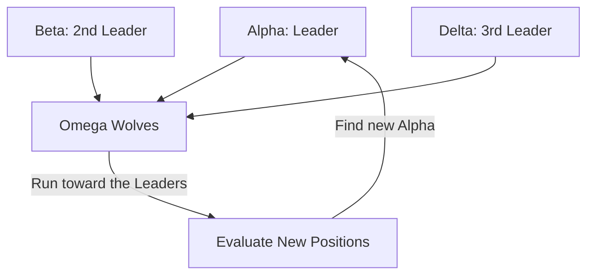

# Grey Wolf Optimizer (GWO-RL)

🧠 **What does this do? (The Analogy)**
Think of a **Wolf Pack hunting a deer**. 
- The **Alpha** (The Leader) is the closest to the deer. 
- The **Beta** and **Delta** are the next closest. 
- All the other wolves (The Omega) look at the Alpha, Beta, and Delta and say: "They know where the deer is! Let's move toward the average of their positions." 
By following the leaders while also "encircling" the target, the wolf pack finds the best solution (the deer) very quickly without getting stuck in a single spot.

🔍 **Step-by-Step Explanation:**
1. **Hierarchy**: Rank the top 3 agents as Alpha ($\alpha$), Beta ($\beta$), and Delta ($\delta$).
2. **Encircling**: Every other agent calculates its distance to these 3 leaders.
3. **Position Update**: The agent moves to a new position that is a weighted average of the 3 leaders' positions.
4. **Convergence**: Over time, the "hunting circle" gets smaller and smaller until the whole pack finds the optimal peak.

📊 **High-Level Design (HLD)**

✅ **Why use this?**
It is one of the most **Mathematically Stable** bio-optimizers. It has very few "knobs" to turn (hyperparameters), making it much easier to set up than PSO or Genetic Algorithms.

🌍 **Real-World Examples:**
1. **Power Grid Optimization**: Balancing 1,000 power plants by treating the "Most efficient" plants as Alphas.
2. **Economic Forecasting**: Using a hierarchy of different models to find the most likely future market price.
