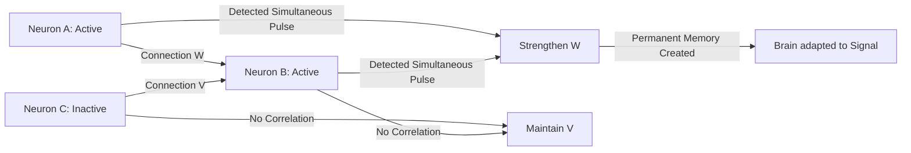

# Hebbian Learning (Bio-Plasticity)

🧠 **What does this do? (The Analogy)**
Think of a **Dirt Path in a park**. 
- If 100 people walk over the grass in the same spot, they crush the grass and create a path. 
- The next person is more likely to walk on that path because it's easier. 
- The more people walk on it, the stronger the path becomes. 
- **Hebbian Learning** is the logic: **"Cells that fire together, wire together."** If Neuron A and Neuron B both activate at the same time, the connection between them gets stronger. This is how biological brains learn patterns without a "Teacher" or a "Score."

🔍 **Step-by-Step Explanation:**
1. **Pre-Synaptic**: The neuron that is sending a signal.
2. **Post-Synaptic**: The neuron that is receiving the signal.
3. **Correlation**: If both neurons are "High" at the same time, the weight between them increases.
4. **Benefit**: It allows for **Local Learning**. You don't need to calculate complex "Gradients" through the whole brain. Every neuron just looks at its neighbors and adjusts its own connections.

📊 **High-Level Design (HLD)**

✅ **Why use this?**
It is the only way to build **Neuromorphic Hardware** (chips that act like brains). It is also used in "Meta-Plasticity" where an AI learns how to *change its own brain* while it is playing a game, allowing it to adapt to new rules instantly.

🌍 **Real-World Examples:**
1. **Biological Brain Modeling**: Simulating how a mouse learns to navigate a maze.
2. **Robot Arm "Proprioception"**: A robot arm learning where its own "elbow" is just by observing the correlations between motor signals and sensor feedback.
