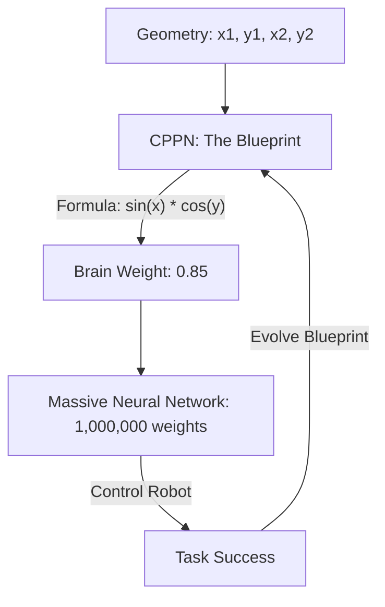

# HyperNEAT (Large Scale Evolution)

🧠 **What does this do? (The Analogy)**
Think of a **Blueprint for a Skyscraper**. 
- Standard NEAT is like a worker who has to build the skyscraper one brick at a time (One connection at a time). 
- **HyperNEAT** is like a **Geometric Blueprint**. The blueprint says: "Every floor should have the same pattern of windows." 
Instead of evolving 1,000,000 individual weights, HyperNEAT evolves a **Mathematical Formula** (a CPPN) that describes the **Pattern** of the brain. Because it understands geometry, it can create massive, symmetrical brains (like a human's) using only a tiny amount of DNA.

🔍 **Step-by-Step Explanation:**
1. **CPPN (Compositional Pattern-Producing Network)**: A small neural network that takes coordinates $(x,y)$ as input and outputs a value.
2. **Substrate**: The physical layout of the brain (e.g., a $100 \times 100$ grid of neurons).
3. **Weight Mapping**: To find the weight between Neuron A $(x1, y1)$ and Neuron B $(x2, y2)$, we ask the CPPN for the answer.
4. **Benefit**: It can evolve **Symmetry** and **Repetition**. If the AI learns that "Left Hand" needs a specific connection, it automatically applies it to the "Right Hand" too.

📊 **High-Level Design (HLD)**

✅ **Why use this?**
It is the only way to evolve **High-Resolution AI**. If you want a robot to learn to "See" through a $1000 \times 1000$ pixel camera, standard evolution is impossible. HyperNEAT makes it easy by evolving the "Pattern" of vision.

🌍 **Real-World Examples:**
1. **Spider Robot Control**: Evolving a brain that controls 8 legs simultaneously using geometric symmetry.
2. **Procedural City Generation**: Evolving a "Blueprint" that generates an entire realistic city layout.
