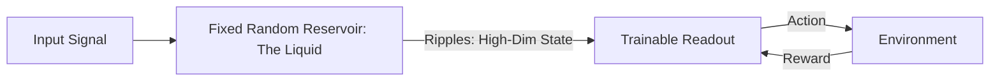

# Liquid State Machines (Reservoir RL)

🧠 **What does this do? (The Analogy)**
Think of a **Quiet Pond of Water**. 
- You drop a stone into the water (The Input). 
- The water creates complex **Ripples** that bounce off the edges and overlap. 
- If you look at the ripples 5 seconds later, you can actually "calculate" the size and shape of the stone just by analyzing the water. 
- **Liquid State Machines (LSM)** are an AI where the brain is a "Reservoir" of random neurons. We don't train the reservoir—we just let the input "ripple" through it and then train a tiny "Readout" layer to understand the ripples. It is the fastest way to handle time-series data.

🔍 **Step-by-Step Explanation:**
1. **The Reservoir**: A massive network of neurons with **Fixed, Random** connections.
2. **Dynamical System**: The input causes the reservoir state to evolve in a complex, non-linear way.
3. **Temporal Memory**: Because the ripples take time to die down, the reservoir naturally "remembers" the past.
4. **Readout Training**: We only train a simple Linear Regression on the outputs of the reservoir to map them to actions.

📊 **High-Level Design (HLD)**

✅ **Why use this?**
It is the best choice for **Extremely Fast Learning**. Because you only train the "Readout" layer (and not the whole brain), you can train a Liquid State Machine in **seconds** where a standard RNN would take hours. It is also very stable.

🌍 **Real-World Examples:**
1. **EEG Brain Wave Decoding**: Mapping raw brain signals into "Left/Right" commands for a wheelchair.
2. **Financial Pulse Detection**: Recognizing "Market Crashes" by feeding the stream of trades into a liquid reservoir and detecting "Turbulent Ripples."
