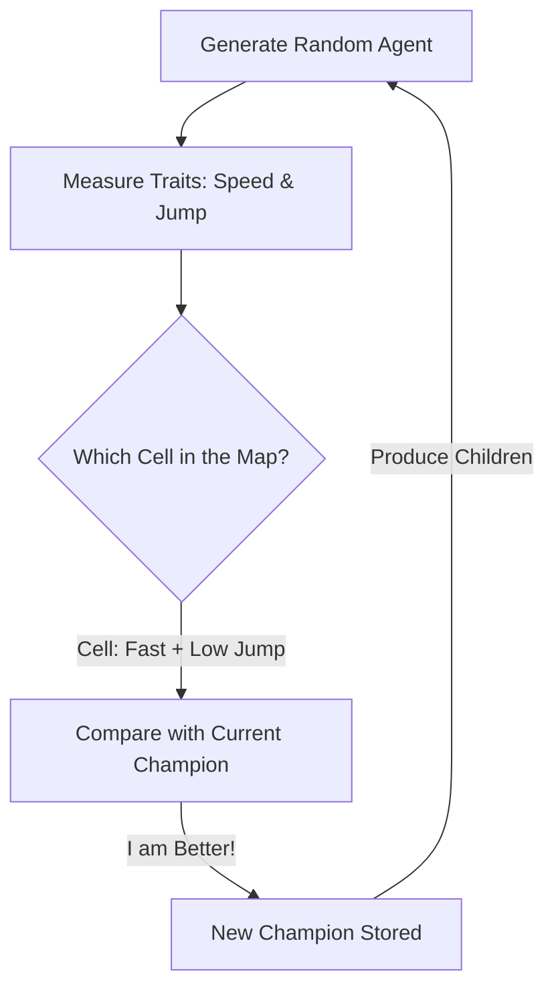

# MAP-Elites (Illuminating Search)

🧠 **What does this do? (The Analogy)**
Think of an **Olympic Training Center**. 
- Most AI algorithms are looking for "The Single Best Athlete." 
- **MAP-Elites** is looking for "The Best Athlete **of every type**." 
- It has a grid. One cell is for "Tall & Fast," another for "Short & Strong," another for "Flexible." 
- It tries to find the world-record holder for every single combination of traits. 
By the end, you don't just have one winner; you have a **Library of Experts**. If the game rules change (e.g., "Now you have to jump over a wall"), you just look in your library and find the athlete who was already the best at jumping.

🔍 **Step-by-Step Explanation:**
1. **Behavioral Dimensions**: Define 2-3 traits you care about (e.g., "Speed" and "Height").
2. **The Grid (Map)**: Divide these traits into cells (e.g., a $10 \times 10$ grid).
3. **Competition**: When a new agent is born, you measure its traits. If it is better than the current "Elite" in its specific cell, it replaces them.
4. **Benefit**: It is the ultimate "Exploration" tool. It "Illuminates" the entire space of possible behaviors.

📊 **High-Level Design (HLD)**

✅ **Why use this?**
It is the gold standard for **Quality-Diversity (QD)**. It is famous for creating robots that can "learn to walk with a broken leg" in 2 minutes, because they already have an "Elite" in their library that was designed to walk using only 3 legs.

🌍 **Real-World Examples:**
1. **Robotic Damage Adaptation**: An hexapod robot that can instantly switch to a new walking style if one of its motors is damaged.
2. **Game Content Generation**: Generating 1,000 different "Hard but Fair" levels for a platformer game.
