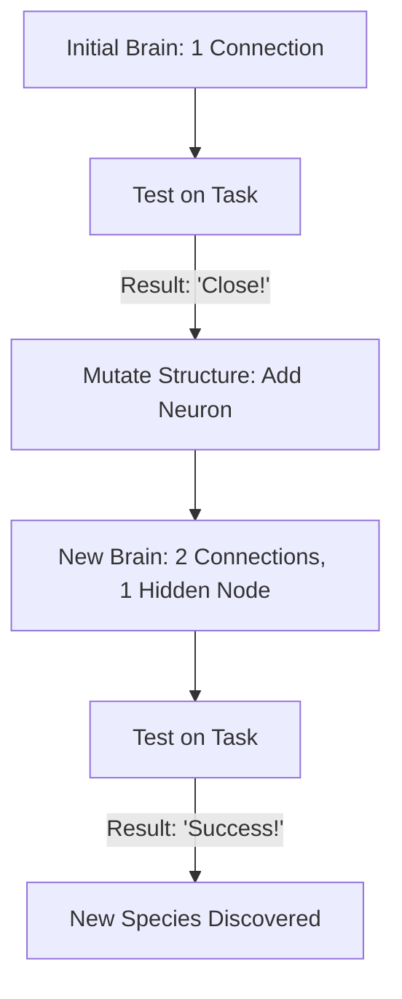

# NEAT (NeuroEvolution of Augmenting Topologies)

🧠 **What does this do? (The Analogy)**
Think of a **Brain that can grow like a Tree**. 
- Standard RL (like PPO or DQN) uses a "Static" brain. You decide the number of layers and neurons at the start, and they never change. 
- **NEAT** is an AI that starts with a **Single Neuron**. Every time it fails, it tries something different. But it doesn't just change the "Weights"—it **grows a new branch** (a new connection) or **adds a new leaf** (a new neuron). Over time, the AI builds the perfect-sized brain for the specific task it is solving.

🔍 **Step-by-Step Explanation:**
1. **The Genome**: A list of all neurons and all connections in the brain.
2. **Mutation**: Randomly adding a new connection between two existing neurons, or splitting a connection to insert a new neuron.
3. **Speciation**: Protecting "Innovations." If an agent discovers a new way to move, NEAT puts them in a "Species" so they don't have to compete with established agents until they have time to optimize.
4. **Benefit**: NEAT can find solutions that standard neural networks can't because it creates the **Structure** of the logic, not just the numbers.

📊 **High-Level Design (HLD)**

✅ **Why use this?**
It is the best choice for **Small-Scale, Complex Logic**. It is famous for being the first algorithm to learn to play **Super Mario Bros.** from scratch by evolving a neural network that "looked" at the screen and understood the concepts of "Gaps" and "Enemies" through its structure.

🌍 **Real-World Examples:**
1. **Bipedal Robot Control**: Evolving a walking gait where the brain structure naturally mirrors the symmetry of the robot's legs.
2. **Game NPC AI**: Creating "Smart" enemies that evolve unique strategies (like flanking or hiding) that no human programmer would have thought to code.
