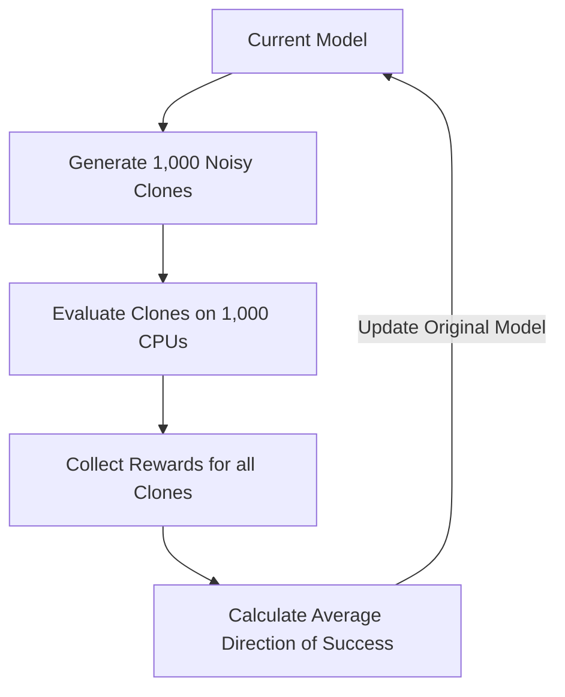

# NES (Natural Evolution Strategies)

🧠 **What does this do? (The Analogy)**
Think of a **Foggy Mountain**. You want to find the top, but you can't see the ground (No Gradients). 
1. You have 50 friends standing around you in a circle. 
2. You ask them: "Who is standing on the highest ground?" 
3. **NES** is the logic: If the friends on the North Side are higher, you move North. 
It uses a **Population** of random samples to "estimate" which way the gradient is pointing, even when the actual math is unknown.

🔍 **Step-by-Step Explanation:**
1. **Jittering**: Add small random noise ($\epsilon$) to the current parameters.
2. **Parallel Evaluation**: Run 100 different versions of the agent at the same time.
3. **Gradient Approximation**: $\nabla \approx \sum R_i \epsilon_i$. 
   - If a specific noise $\epsilon$ led to a high reward $R$, the gradient points in that direction.
4. **Benefit**: It is **Massively Parallel**. You can train an AI on 1,000 CPUs in the time it takes to train on 1 GPU. It is much more stable than standard RL for long-horizon tasks.

📊 **High-Level Design (HLD)**

✅ **Why use this?**
OpenAI used NES to prove that "Evolution is as good as Reinforcement Learning." It is the best choice if you have a **Large Cluster of CPUs** but no GPUs. It can solve Atari games and robotic walking tasks in minutes.

🌍 **Real-World Examples:**
1. **Satellite Constellation Control**: Co-evolving the strategies of 1,000 satellites simultaneously.
2. **Procedural Content Generation**: Evolving "Fun" levels for a video game by testing thousands of variations with AI players.
3. **Hardware-In-The-Loop Optimization**: Tuning the parameters of a physical engine where the math is too complex to calculate, but testing is cheap.
