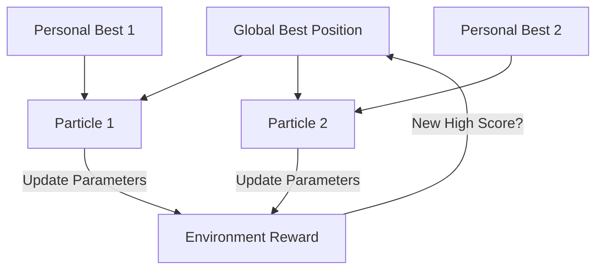

# Particle Swarm Optimization (PSO-RL)

🧠 **What does this do? (The Analogy)**
Think of a **Flock of Birds looking for corn in a field**. 
- Each bird (Particle) is flying around randomly. 
- But every bird has a memory of **The best spot they personally found** (Cognitive). 
- And every bird knows **The best spot the whole flock has found** (Social). 
The birds adjust their speed and direction to balance between "Checking out that spot I liked" and "Heading toward where the group is eating." Eventually, the whole flock "swarms" onto the biggest pile of corn in the field.

🔍 **Step-by-Step Explanation:**
1. **The Particle**: A set of weights for a neural network.
2. **Cognitive Component**: The tendency to move back toward the best parameters *this specific agent* has ever had.
3. **Social Component**: The tendency to move toward the best parameters *any agent in the swarm* has ever had.
4. **Velocity**: The parameters change smoothly, not randomly. This allows the swarm to "orbit" the best solution and converge on it.

📊 **High-Level Design (HLD)**

✅ **Why use this?**
It is extremely **Robust to Noise**. If your reward function changes slightly or has random "glitches," PSO won't get confused like Gradient Descent would. It is very fast and easy to parallelize.

🌍 **Real-World Examples:**
1. **Antenna Positioning**: Optimizing the angle and power of 1,000 antennas to cover a city perfectly.
2. **Hydroelectric Dam Control**: Balancing the water flow across 20 different turbines to maximize electricity while keeping the dam safe.
