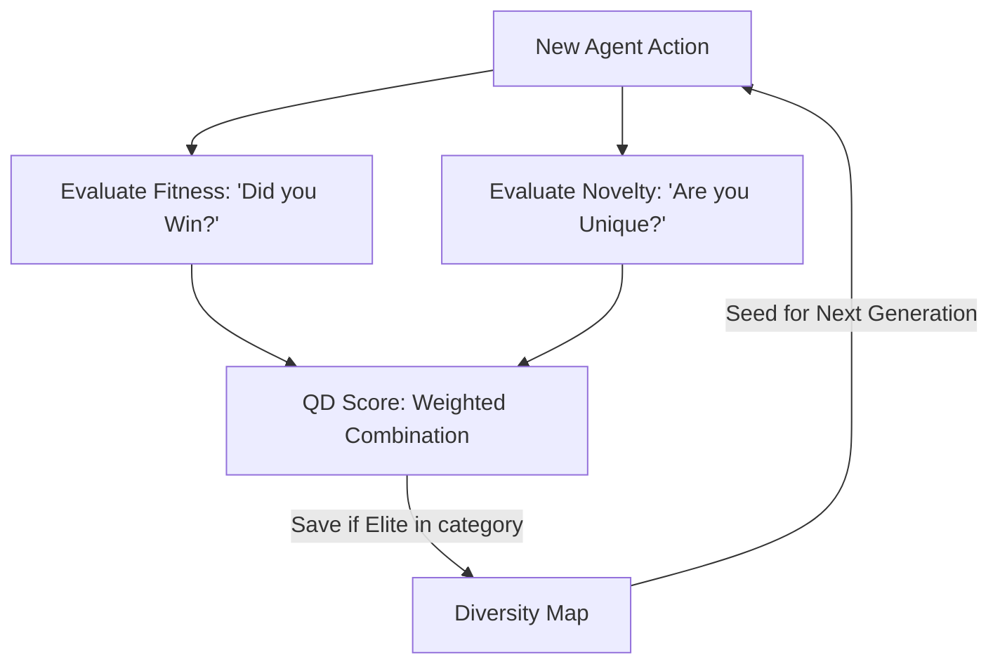

# Quality-Diversity (QD-RL)

🧠 **What does this do? (The Analogy)**
Think of a **Cooking Competition**. 
- Standard RL (Quality Only) is a competition where everyone tries to cook the "Perfect Burger." By the end, everyone is making the exact same burger. 
- Novelty Search (Diversity Only) is a competition where someone makes a "Chocolate-Covered Pickle" just to be different, even if it tastes terrible. 
- **Quality-Diversity (QD)** is a competition where you want the **Best Burger**, the **Best Sushi**, and the **Best Pasta**. 
It rewards agents for being **The Best in their specific Category**. This ensures you have a team of diverse experts rather than a crowd of identical copies.

🔍 **Step-by-Step Explanation:**
1. **Multi-Objective**: The AI is given two scores: a "Fitness" score (How well did I do?) and a "Novelty" score (How different am I?).
2. **Pareto Optimization**: It looks for the "Frontier" where agents are as good as possible without losing their uniqueness.
3. **Behavior Archive**: It uses a map (like MAP-Elites) to keep track of the champions in every category.
4. **Benefit**: It is the ultimate insurance against "Catastrophic Forgetting." If the game environment changes, you already have a diverse set of behaviors ready to adapt.

📊 **High-Level Design (HLD)**

✅ **Why use this?**
It is the current **Cutting Edge of Robotics**. It allows for "Skill Discovery" where a robot automatically learns to walk, run, jump, and crawl without the programmer having to define those tasks.

🌍 **Real-World Examples:**
1. **Automated Drug Discovery**: Finding chemicals that are both "Safe" (Quality) and "New/Unpatented" (Diversity).
2. **Level Design for AAA Games**: Creating 100 different boss fights that are all "Challenging" but use completely different mechanics.
