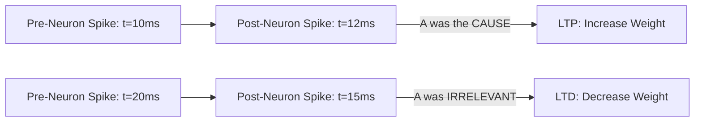

# STDP (Spike-Timing-Dependent Plasticity)

🧠 **What does this do? (The Analogy)**
Think of a **Drummer and a Guitarist**. 
- If the Drummer hits the snare **exactly before** the Guitarist plays a chord, it sounds great (Causality). They become a "Team" (Stronger Connection). 
- If the Drummer hits the snare **after** the Guitarist already played, it sounds like a mistake (Anti-Causality). They stop playing together (Weaker Connection). 
**STDP** is an AI that learns based on the **Timing** of events. It understands that if Event A always happens before Event B, then A likely **caused** B.

🔍 **Step-by-Step Explanation:**
1. **Long-Term Potentiation (LTP)**: If the pre-synaptic neuron spikes slightly before the post-synaptic neuron, the connection weight is increased.
2. **Long-Term Depression (LTD)**: If the pre-synaptic neuron spikes after the post-synaptic neuron, the connection weight is decreased.
3. **Temporal Asymmetry**: The learning is sensitive to milliseconds. This is how humans learn that "The stove is hot" because the pain happens *instantly after* the touch.
4. **Benefit**: It is a completely **Unsupervised** way to learn causality in time-series data.

📊 **High-Level Design (HLD)**

✅ **Why use this?**
It is the gold standard for **Real-Time Sensor Processing**. If you want an AI to learn to "Recognize a gesture" or "Detect a pattern in sound," STDP allows it to learn the timing of the signal perfectly.

🌍 **Real-World Examples:**
1. **Speech Recognition**: Learning the timing of phonemes (e.g., 'p' comes before 'a') to recognize words.
2. **Brain-Machine Interfaces**: Decoding the firing patterns of neurons in a human's motor cortex to move a robotic arm.
