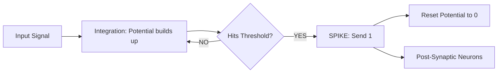

# Spiking Neural RL (Event-Based)

🧠 **What does this do? (The Analogy)**
Think of a **Toilet Flushing**. 
- You can push the handle a little bit, and nothing happens (Integration). 
- You push it more, and still nothing happens. 
- But once you reach a **Threshold**, the toilet flushes completely (The Spike). 
- Then it takes time to refill before it can flush again (Refractory Period). 
**Spiking Neural Networks (SNNs)** are the most biologically accurate form of AI. Instead of sending continuous numbers (like 0.42), they send **Electrical Pulses (Spikes)**. This is how the human brain saves energy—it only "works" when a spike occurs.

🔍 **Step-by-Step Explanation:**
1. **Membrane Potential**: A hidden variable inside the neuron that "builds up" as it receives input.
2. **The Threshold**: If the potential hits a specific limit, the neuron "fires" a 1 and resets to 0.
3. **Temporal Coding**: Information is carried not by the *size* of the signal, but by the *timing* of the spikes.
4. **Benefit**: It is **1,000x more energy efficient** than standard neural networks. It is perfect for robots that need to run on a small battery for a long time.

📊 **High-Level Design (HLD)**

✅ **Why use this?**
It is the future of **Ultra-Low Power Robotics**. Companies like Intel (Loihi) and IBM (TrueNorth) have built computer chips that only run SNNs. This allows for AI that is as fast as a human but uses less power than a lightbulb.

🌍 **Real-World Examples:**
1. **DVS (Event Cameras)**: Cameras that only report "Change" in pixels. SNNs are the perfect way to process this high-speed, low-power data.
2. **Prosthetic Limbs**: Using spikes to communicate directly between a computer and a human's nervous system.
