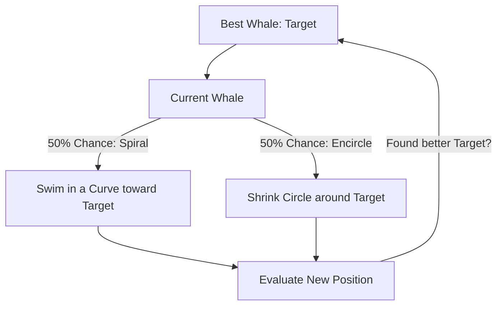

# Whale Optimization (Bubble-Net Hunting)

🧠 **What does this do? (The Analogy)**
Think of a **Humpback Whale hunting a school of fish**. 
1. The whale swims in a **Spiral Pattern** while blowing bubbles. 
2. The bubbles create a "net" that traps the fish and pushes them toward the center. 
3. **WOA** is an AI that optimizes by "spiraling" around the best solution. Instead of just running straight toward the goal (which might lead into a trap), it circles it, gradually getting closer and closer until it "strikes" the exact optimal point.

🔍 **Step-by-Step Explanation:**
1. **Shrinking Encircle**: The "circle" around the best agent gets smaller over time.
2. **Spiral Update**: A mathematical spiral equation $(D \cdot e^{bl} \cdot \cos(2\pi l))$ moves the agent toward the leader in a curvy path.
3. **Random Search**: Occasionally, a whale swims away to look for a **New** school of fish (Exploration).
4. **Benefit**: The spiral movement is very good at avoiding "Plateaus" (flat areas) in the reward function where other algorithms might stop moving.

📊 **High-Level Design (HLD)**

✅ **Why use this?**
It is a **Very High-Speed Optimizer**. It often finds the "Global Maximum" in half the time it takes for Genetic Algorithms or PSO.

🌍 **Real-World Examples:**
1. **Photovoltaic (Solar) Tracking**: Spiraling the angle of solar panels to find the absolute brightest point in a cloudy sky.
2. **Structural Shape Optimization**: Finding the most aerodynamic shape for a car wing by "spiraling" through different curves.
