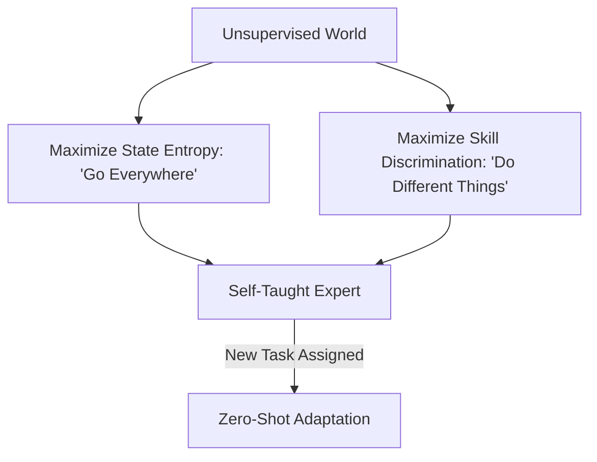

# APS (Active Pretraining with Skills)

🧠 **What does this do? (The Analogy)**
Think of a **Gymnastics Student in an empty gym**. 
- They have no coach and no competition. 
- **APS** is the logic that tells the student: "Don't just sit there. First, explore the whole gym (State Entropy). Then, practice 10 different moves (Skill Discovery)." 
- The student practices doing a backflip, a handstand, and a split until they can do each one perfectly on command. 
- Later, when a coach arrives and says "I need you to climb that rope," the student already knows how to use their arms and legs perfectly. They have "Pretrained" themselves for any future task.

🔍 **Step-by-Step Explanation:**
1. **Unsupervised Learning**: APS happens before the AI is told what its "Real Goal" is.
2. **State Entropy**: The agent is rewarded for finding parts of the room it hasn't seen before.
3. **Successor Features**: The agent learns "What follows what."
4. **Skill Diversity**: The agent is rewarded for developing a library of "distinct" behaviors.
5. **Benefit**: When you finally give the AI a reward (e.g., "Find the exit"), it already knows the map and its own capabilities. It can solve the task in 100 steps instead of 1,000,000.

📊 **High-Level Design (HLD)**

✅ **Why use this?**
It is the current **SOTA for Foundation Models in RL**. Just like GPT-4 was pretrained on the whole internet, APS pretrains a robot on its "Whole Environment" so it is ready for anything.

🌍 **Real-World Examples:**
1. **General-Purpose Service Robots**: A robot that "plays" in a new kitchen for 2 hours while the owners are away, so that when they come home and ask for "Coffee," it already knows where the cups are and how to open the cupboard.
2. **Autonomous Exploration Drones**: A drone that maps an entire cave system using "Curiosity" before it is ever given a specific search-and-rescue mission.
