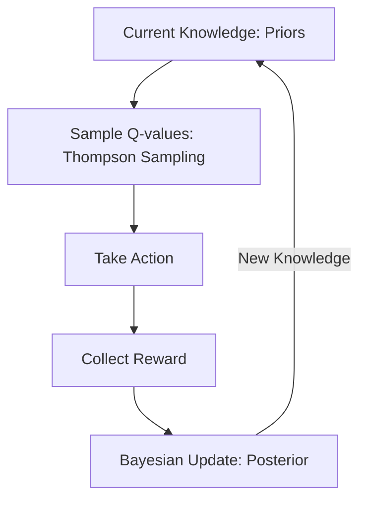

# Bayesian Reinforcement Learning

🧠 **What does this do? (The Analogy)**
Think of a **Scientist in a lab**. Standard RL is like a scientist who sees one result and says "This is the truth!" **Bayesian RL** is like a scientist who says: "Based on my 10 experiments, there is an 80% chance the theory is true, but I need more data to be sure." Instead of just learning a single value, the agent learns a **Probability Distribution** of values. It knows exactly how "Confident" it is in its own knowledge.

🔍 **Step-by-Step Explanation:**
1. **The Posterior**: The agent maintains a probability distribution $P(Q | \text{Data})$ for every state-action pair.
2. **Exploration (Thompson Sampling)**: To decide what to do, the agent "rolls the dice" (samples) from its distributions. If it's uncertain about an action, the spread is wide, and it's more likely to try it.
3. **Epistemic Uncertainty**: This is the uncertainty caused by a "lack of data." As the agent collects more data, the distributions shrink (it becomes more certain).
4. **The Benefit**: It provides a mathematically optimal way to balance Exploration and Exploitation. It never "over-explores" areas it already knows well.

📊 **High-Level Design (HLD)**

✅ **Why use this?**
It is the most advanced way to handle **Risk**. If a specific action has a 1% chance of causing a catastrophic failure, a standard RL agent might take it. A Bayesian RL agent will see that 1% risk in its distribution and stay far away.

🌍 **Real-World Examples:**
1. **Oil Drilling**: Deciding where to drill based on a Bayesian model of the underground geology—drilling is expensive, so the AI must be highly certain before acting.
2. **Personalized Medicine**: Designing a drug dosage for a specific patient by modeling the uncertainty of how their unique body will react.
