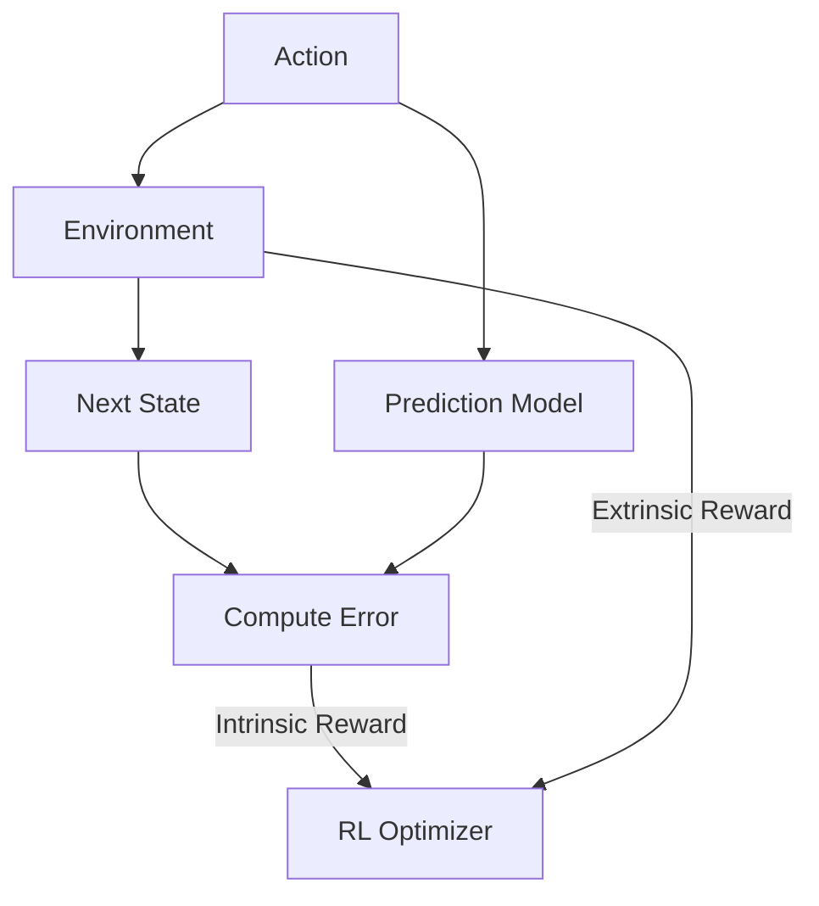

# Curiosity-Driven Reinforcement Learning

## Introduction
In many environments, rewards are **sparse** (e.g., a robot finding a key in a huge house). Standard RL fails here. Curiosity-driven RL adds an **Intrinsic Reward** based on how "surprised" the agent is by the environment.

## Core Concepts
- **Forward Dynamics Model**: A network that tries to predict the next state $s_{t+1}$ given $s_t$ and $a_t$.
- **Intrinsic Reward**: The error between the prediction and the actual next state.
- **Exploration**: The agent is motivated to visit states that it cannot yet predict accurately.

## High-Level Design (HLD)

## Pros and Cons
| Pros | Cons |
| :--- | :--- |
| Works in zero-reward environments | "TV Problem" (Gets stuck on random noise) |
| Much faster exploration | Prediction model adds complexity |
| More "human-like" learning | Hard to balance Intrinsic vs Extrinsic rewards |

---

## Interview Questions
**Q: What is the "Noisy TV" problem?**
A: If a TV is showing random noise, the agent can never predict the next frame perfectly. In early curiosity models, the agent would get stuck staring at the TV forever because the "surprise" reward was always high.

**Q: How do we fix the Noisy TV problem?**
A: By using an **Inverse Dynamics Model** that only learns to predict changes in the environment caused by the agent's actions, ignoring random background noise.
