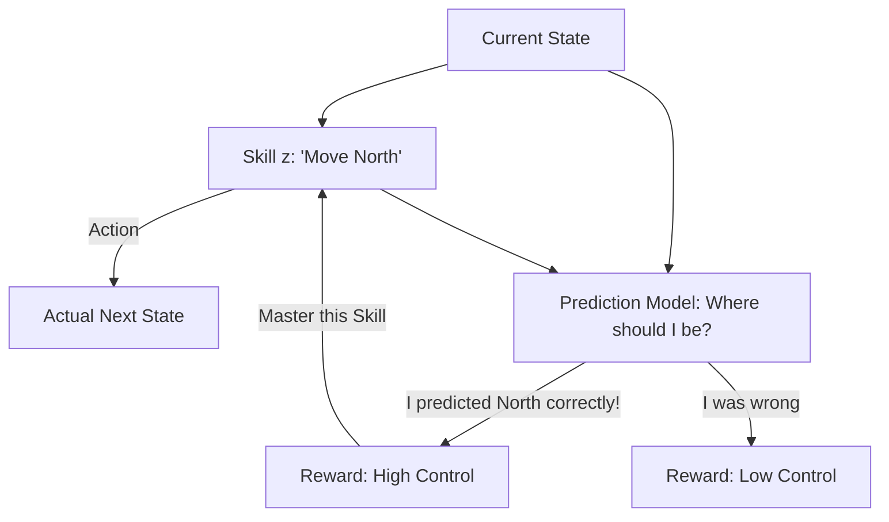

# DADS (Dynamics-Aware Discovery of Skills)

🧠 **What does this do? (The Analogy)**
Think of a **Scientist conducting 10 different Experiments**. 
- **Standard Discovery (DIAYN)** wants the results to look different. 
- **DADS** wants the results to be **Predictable**. 
- If I choose "Skill #1," I should be able to predict exactly where I will be in 5 seconds. 
- If I choose "Skill #2," I should be able to predict a different location. 
**DADS** is an AI that learns skills that are **Reliable**. It doesn't just want to be "diverse"—it wants to be "in control" of the laws of physics.

🔍 **Step-by-Step Explanation:**
1. **The World Model**: The agent learns a model that predicts $P(s' | s, z)$, where $z$ is the skill.
2. **Mutual Information**: It maximizes the information that the skill $z$ provides about the future state $s'$.
3. **Control**: A skill is "discovered" only if it results in a movement that the agent can predict perfectly.
4. **Benefit**: Because these skills are based on "Physics" (Dynamics), they are much more useful for **Planning** than DIAYN skills. You can "Chain" DADS skills together to reach a goal.

📊 **High-Level Design (HLD)**

✅ **Why use this?**
It is the best choice for **Model-Based Skill Discovery**. It allows an AI to build a "Toolbox" of reliable actions that it can then use to solve any puzzle or navigate any maze.

🌍 **Real-World Examples:**
1. **Autonomous Car Maneuvers**: Learning 10 different ways to "Parallel Park" or "Lane Change" that are 100% predictable and safe.
2. **Robotic Manufacturing**: Discovering the most "reliable" ways to push a box across a table without it slipping.
