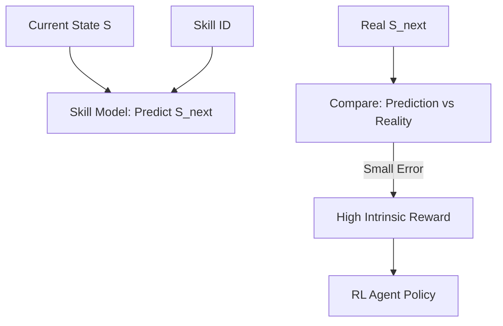

# DADS (Dynamics-Aware Discovery of Skills)

🧠 **What does this do? (The Analogy)**
Think of a **Scientist conducting Experiments**. They don't just want to be "Different" (like DIAYN); they want to be **Predictable**. They think: "If I choose Skill #1, I predict the test tube will turn Blue." If they choose Skill #1 and the tube actually turns blue, they have mastered that skill. **DADS** discovers skills by finding actions that make the world's physics easy to predict for the AI. It's like the AI is trying to become a "Master of its own Universe."

🔍 **Step-by-Step Explanation:**
1. **Predictive Model**: The agent learns to predict $s_{t+1}$ given $s_t$ and the current Skill ID ($z$).
2. **Mutual Information**: The reward is high if knowing the Skill ID tells you a lot about where the agent will be in the next second.
3. **The "Surprise" Factor**: A skill is good if it moves the agent into a state that is **Normally Unpredictable**, but becomes **Predictable** only when that specific skill is active.
4. **Benefit**: DADS skills are often more "useful" than DIAYN skills because they are tied to the actual physics of the environment.

📊 **High-Level Design (HLD)**

✅ **Why use this?**
It is one of the most stable ways to learn **Complex Manipulation**. A robot arm using DADS will naturally learn to "Push," "Pull," and "Grab" because those are the actions that have the most predictable effect on the environment.

🌍 **Real-World Examples:**
1. **Robotic Hand Skills**: Learning how to rotate a cube or flick a switch entirely through unsupervised "predictability" training.
2. **Autonomous Drones**: Learning different flight maneuvers (e.g., hovering vs. diving) by discovering which maneuvers have the most stable and predictable physics.
