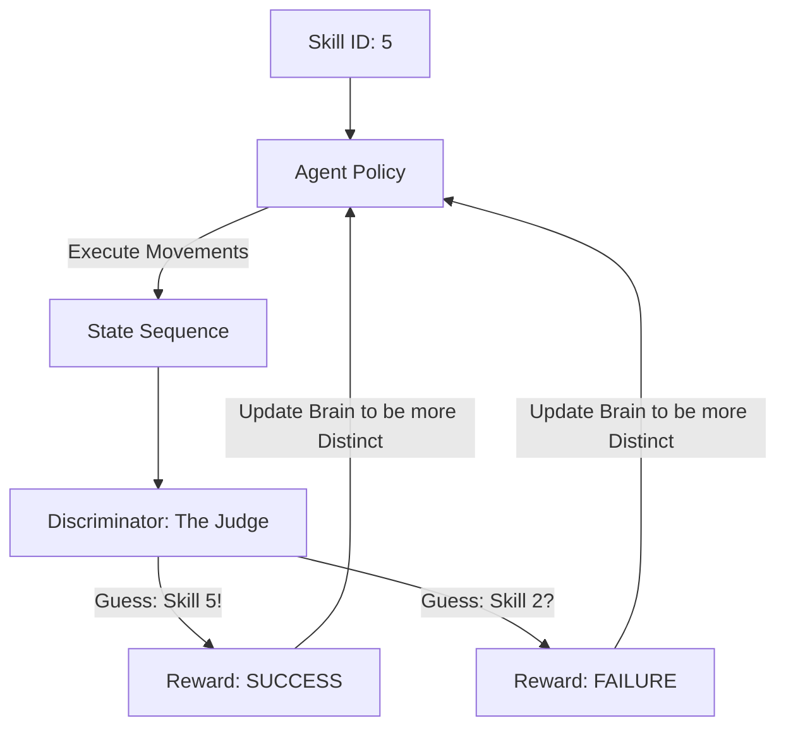

# DIAYN (Diversity Is All You Need)

🧠 **What does this do? (The Analogy)**
Think of an **Actor playing 10 different characters**. 
- To be a good actor, the audience must be able to tell the characters apart. 
- If the actor says: "I am playing the King," and the audience says: "You look like the Beggar," the actor has failed. 
- **DIAYN** is an AI that practices being "Unique." It develops 10 different "Skills" (Character roles). 
- It is rewarded only if a judge (The Discriminator) can correctly guess which skill the AI is trying to perform just by looking at its movements. 
- This forces the AI to invent diverse behaviors like "Running," "Jumping," and "Spinning" without anyone ever telling it to do those things.

🔍 **Step-by-Step Explanation:**
1. **Unsupervised**: No external rewards (game scores) are needed.
2. **The Discriminator**: A small neural network that tries to guess the "Skill ID" from the agent's trajectory.
3. **Information Maximization**: The agent is rewarded for making the Discriminator's job as easy as possible.
4. **Mutual Information**: $I(Skill ; State)$ is maximized.
5. **Benefit**: You end up with an AI that has a "Menu" of skills. Later, when you want it to "Walk," you just pick the skill that happens to look like walking.

📊 **High-Level Design (HLD)**

✅ **Why use this?**
It is the gold standard for **Zero-Shot Skill Discovery**. It allows a robot to "learn everything its body can do" before it is ever given a specific job.

🌍 **Real-World Examples:**
1. **Humanoid Robot Pretraining**: A robot that discovers how to balance, roll, and stand up on its own just by trying to be "diverse."
2. **Game Character Animation**: Automatically discovering 50 different "Dance Moves" for a character by rewarding the AI for making each dance unique.
