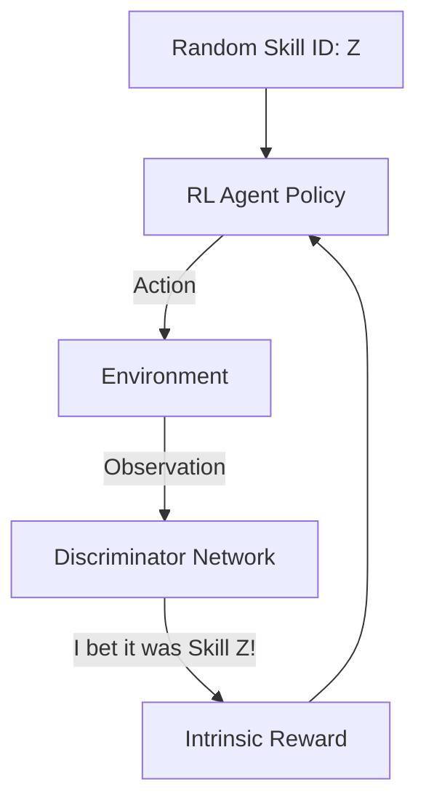

# DIAYN (Diversity Is All You Need)

🧠 **What does this do? (The Analogy)**
Think of a **Toddler in a Playroom** with no parents and no rules. They don't have a "Goal" like "Win the Game." Instead, they just want to be **Unique**. They think: "First, I'll learn to Jump. Then, I'll learn to Spin. Then, I'll learn to Crawl." They make sure that jumping looks completely different from spinning. By learning as many **Diverse Skills** as possible while they are alone, they are ready for any game the parents might give them later.

🔍 **Step-by-Step Explanation:**
1. **Unsupervised Learning**: The agent receives **ZERO** reward from the environment.
2. **Skill Latent ($z$)**: We give the agent a random "Skill ID" (e.g., Skill #3).
3. **The Discriminator**: A neural network tries to look at the agent's movement and **Guess** which Skill ID was active.
4. **The Reward**: The agent is rewarded if the Discriminator can guess the Skill ID easily. This forces the agent to make each skill look unique and distinct.
5. **Entropy**: The agent is also rewarded for being "Maximum Entropy" (random) within that skill to ensure it explores.

📊 **High-Level Design (HLD)**

✅ **Why use this?**
It is the ultimate tool for **Pre-training**. You can let a robot play in a simulation for 10 hours without any reward. It will learn to walk, jump, and crawl on its own. When you finally give it a goal (e.g., "Go to the Door"), it already knows how to walk, so it finishes the task instantly.

🌍 **Real-World Examples:**
1. **Robotic Warm-up**: A new robot learns all the different ways its joints can move before it ever starts its first day at the factory.
2. **Game Character NPC**: An NPC that has 20 different "Styles" of walking or behaving, all learned without a human ever writing a single line of animation code.
