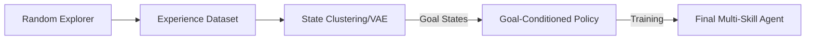

# EDL (Explore, Discover, Learn)

🧠 **What does this do? (The Analogy)**
Think of a **University Student**. 
- **Stage 1 (Explore)**: They go to the library and read every book they can find just to see what's out there (**Maximum Entropy**).
- **Stage 2 (Discover)**: They look at all the info and say "Hey, these 10 books are about Math, these 10 are about Music." They find the **Core Categories** of knowledge.
- **Stage 3 (Learn)**: They pick one category (e.g., Math) and practice until they are an expert.
**EDL** is an AI that follows this exact 3-step education.

🔍 **Step-by-Step Explanation:**
1. **Explore**: Use a completely random (max-entropy) policy to visit as many different states as possible.
2. **Discover**: Use a "Variational Autoencoder" or Clustering to find the most "important" or "different" states in the data. These become the **Goals**.
3. **Learn**: Train a goal-conditioned policy (like UVFA) to reach those specific states on command.
4. **Benefit**: Unlike DIAYN (which can get stuck learning "useless" skills), EDL ensures the skills are based on the actual diversity of the world.

📊 **High-Level Design (HLD)**

✅ **Why use this?**
It is one of the most reliable ways to build a **Foundation Model** for RL. Once the 3 stages are done, you have an agent that can go to any part of the environment on command, even if it has never been given a single reward point.

🌍 **Real-World Examples:**
1. **Autonomous Mapping**: A drone that first explores a whole building randomly (Explore), finds the "Kitchen," "Office," and "Exit" (Discover), and then learns to navigate between them perfectly (Learn).
2. **Industrial Process Control**: An AI that explores all the different ways a factory can run, discovers the 5 most "stable" configurations, and then learns to switch between them.
