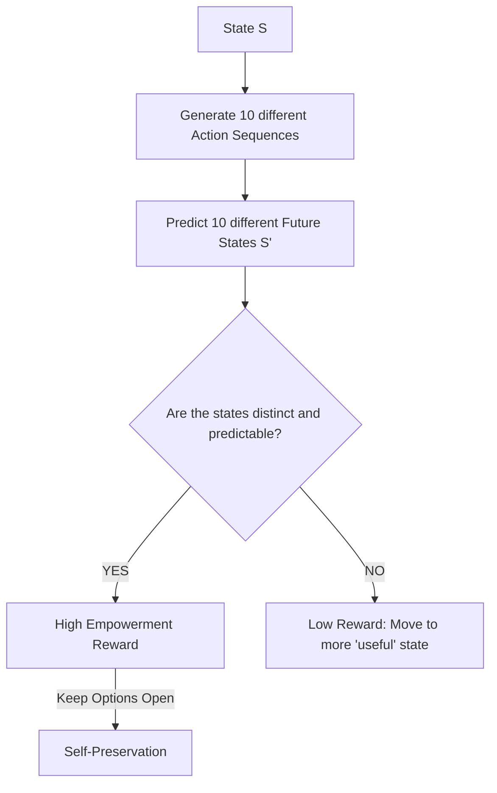

# Empowerment Driven RL

🧠 **What does this do? (The Analogy)**
Think of a **Person in a dark room with a light switch**. 
- If they stand in the corner, they can't do anything (Low Empowerment). 
- If they stand next to the light switch, they have the **Power** to change the state of the entire room (High Empowerment). 
**Empowerment** is an AI that is obsessed with "Potential." It doesn't want a "High Score"—it wants to be in a position where **any action it takes has a big, predictable effect.** It wants to have as many "Options" as possible.

🔍 **Step-by-Step Explanation:**
1. **Mutual Information**: Measures the correlation between the actions the AI takes and the future states it reaches.
2. **Channel Capacity**: Empowerment is the "Maximum bandwidth" of the communication channel from the AI's "Mind" to the "World."
3. **The Center of the Map**: In most games, the center is more empowering than the corner because you can move in 4 directions instead of 2.
4. **Benefit**: It produces "Natural" looking behavior. An empowered AI will naturally stay away from walls, keep its balance, and hold onto useful tools, even if it has no specific "Job" to do.

📊 **High-Level Design (HLD)**

✅ **Why use this?**
It is the best choice for **Survival and Self-Preservation**. If you want a robot to "Stay Alive" in a dangerous forest, you don't reward it for "Winning"—you reward it for having "Empowerment." It will naturally avoid being trapped or broken.

🌍 **Real-World Examples:**
1. **Autonomous Drones**: Staying in a clear area where they have 360 degrees of movement potential, rather than flying into a tight canyon.
2. **Economic Policy**: Designing a city where people have high "Economic Empowerment" (many job options and education paths) rather than being stuck in a single industry.
