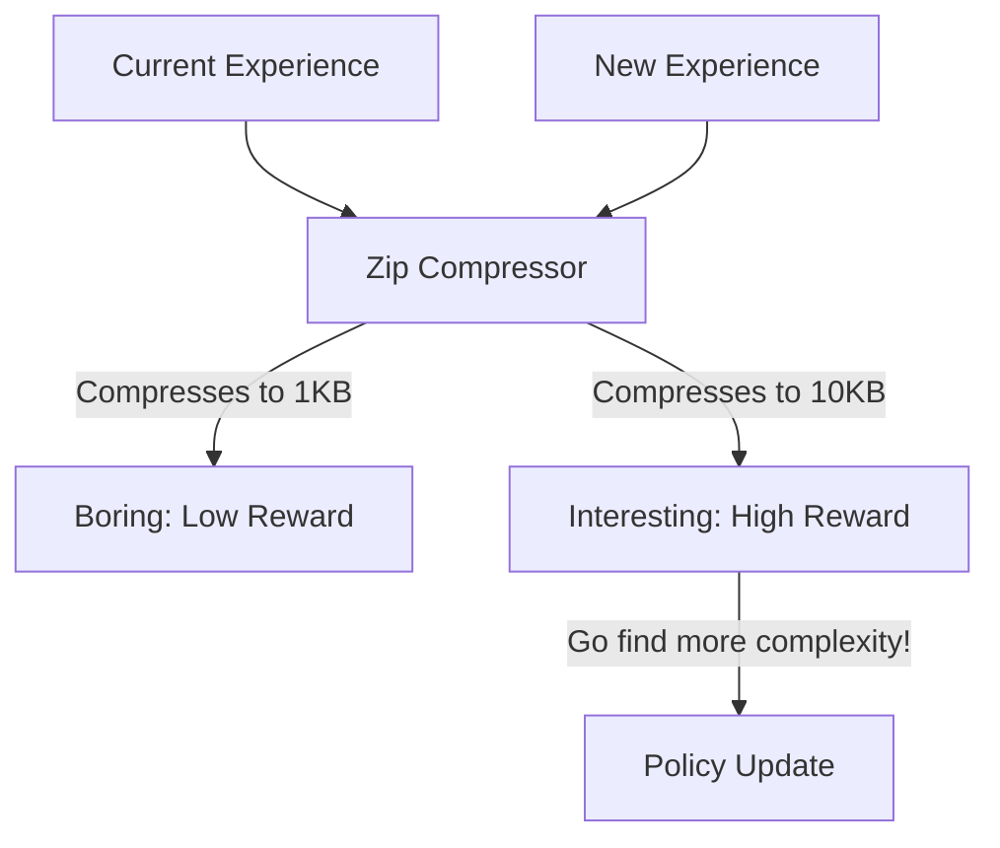

# Exploration via Compression (Complexity-based Curiosity)

🧠 **What does this do? (The Analogy)**
Think of a **Person reading a book**. 
- If the book says "The dog ran. The dog ran. The dog ran." (High Redundancy), the person gets bored and stops reading. 
- If the book says something completely new on every page (Low Redundancy), the person is "curious" and keeps reading. 
- **Exploration via Compression** is an AI that gets a reward whenever it finds a "page" of its life that it **cannot easily compress**. 
- It wants to live a life that is "Complex" and full of new information, rather than a repetitive life of doing the same thing over and over.

🔍 **Step-by-Step Explanation:**
1. **Kolmogorov Complexity**: A mathematical measure of how "complex" a piece of data is based on the smallest computer program that could generate it.
2. **Compression Ratio**: The agent records its experiences. If a new experience can be "zipped" into a tiny file, it means it's boring and similar to the past.
3. **The Reward**: The agent is rewarded for finding experiences that make its "experience zip file" grow larger.
4. **Benefit**: It is **Feature-Agnostic**. It doesn't need to know what the data "means"—it just needs to know if it's "New."

📊 **High-Level Design (HLD)**

✅ **Why use this?**
It is the best choice for **Open-World Discovery**. If you want an AI to "discover the laws of its world" without being given any specific goals, rewarding it for "complexity" is the most universal way to make it smart.

🌍 **Real-World Examples:**
1. **Autonomous Web Crawlers**: An AI that only visits websites that contain "New Patterns" of data, avoiding millions of duplicate "copy-paste" spam sites.
2. **Art-Generating AI**: Rewarding a generator for creating images that have "Complex Patterns" that the AI hasn't seen before.
