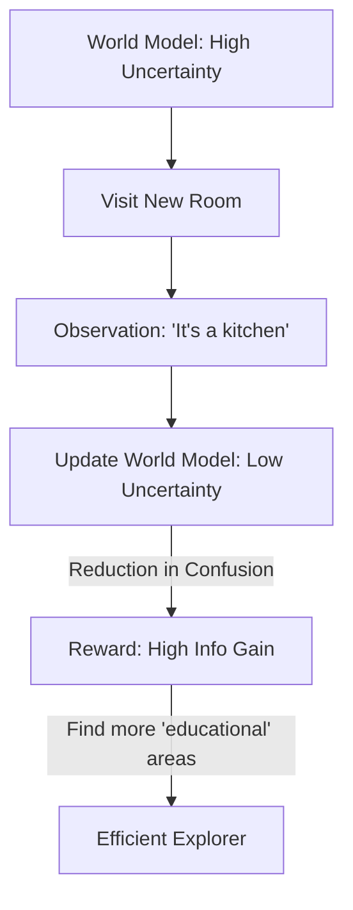

# Exploration via Information Gain

🧠 **What does this do? (The Analogy)**
Think of a **Detective solving a mystery**. 
- They have a list of 10 suspects. 
- They find a fingerprint that proves Suspect A was at home (Information Gain). 
- Now they are **Less Confused** about the killer. 
- **Information Gain RL** is an AI that gets a "Mental Reward" whenever it finds a fact that makes its "World Model" more accurate. It doesn't want to just "see things"—it wants to see things that **Solve its confusion.**

🔍 **Step-by-Step Explanation:**
1. **The Model**: A neural network that predicts the future.
2. **Uncertainty**: The "width" of the model's guess (e.g., "The next state is between 10 and 100").
3. **Information Gain**: After seeing the next state, the AI's guess becomes "The state is exactly 50."
4. **The Reward**: The difference in the "Size of the Uncertainty" (Entropy) before and after the observation.
5. **Benefit**: It prevents the "TV Problem" (ICM). In ICM, an AI will stare at a TV with random static because it's "surprised." Info Gain AI realizes it **can't learn anything** from static, so it moves on.

📊 **High-Level Design (HLD)**

✅ **Why use this?**
It is the best choice for **Targeted Discovery**. It is the most "Human-like" curiosity because it only values information that is **Useful** for its understanding of the world.

🌍 **Real-World Examples:**
1. **Medical Diagnostics AI**: Choosing to run the one specific blood test that will most likely "Rule out" 5 different diseases at once.
2. **Autonomous Mapping**: A drone that flies toward "The edges of the unknown" where its map is the most blurry.
