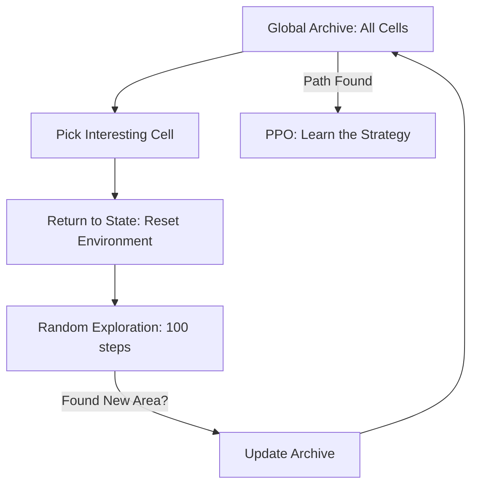

# Go-Explore (Solving Hard Exploration)

🧠 **What does this do? (The Analogy)**
Think of an **Explorer in a massive Cave**. Standard RL is like an explorer who keeps wandering blindly and getting lost (Detachment). **Go-Explore** is like an explorer who **builds a Base Camp** at every new room they find. If they find a locked door, they don't just wander around; they go back to a specific Base Camp where they found a key, and *then* they start exploring. It separates "Finding" a place from "Learning" how to get there.

🔍 **Step-by-Step Explanation:**
1. **Archive**: A library that stores a "Snapshot" of every unique state the agent has ever reached.
2. **Phase 1 (Explore)**: 
   - Pick a random state from the archive.
   - "Teleport" the agent back to that state.
   - Explore randomly for a few steps to find something new.
   - Save any new "Discoveries" back to the archive.
3. **Phase 2 (Robustify)**: Once the archive has a path to the goal, use standard RL (like PPO) to learn how to walk that path reliably.
4. **Formula**: Success is measured by the **Archive Coverage** (how many unique "cells" the agent has visited).

📊 **High-Level Design (HLD)**

✅ **Why use this?**
It is the only algorithm that truly "solved" **Montezuma's Revenge**. Standard RL got a score of 0; Go-Explore got a score of **400,000**. It is perfect for tasks with "Sparse Rewards" where you have to do 1,000 specific things before getting a single point.

🌍 **Real-World Examples:**
1. **Drug Molecule Generation**: Storing an archive of "Chemical Skeletons" and returning to them to try different additions, rather than starting from scratch every time.
2. **Infinite Video Game Testing**: Automatically finding every secret room in a game like Elden Ring or Zelda by archiving every coordinate the AI reaches.
