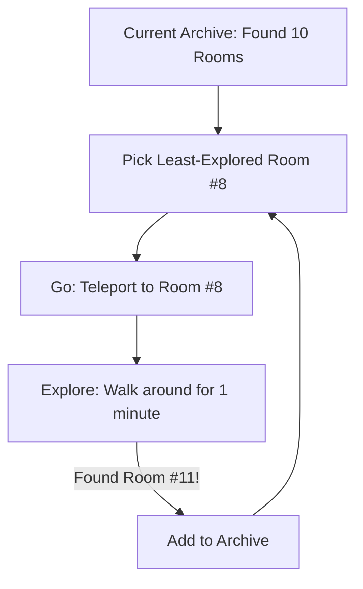

# Go-Explore (Robotic Memory)

🧠 **What does this do? (The Analogy)**
Think of a **Hiker in a massive Cave**. 
- Standard RL is like a hiker who keeps wandering randomly from the entrance. They keep getting lost and returning to the start. 
- **Go-Explore** is like a hiker who has a **Map and a Teleporter**. Every time they find a new room, they mark it on the map. If they get lost, they **Teleport** back to the most interesting room they found earlier and start exploring from there. 
By "Go"-ing back to where they were and then "Explore"-ing, they can find the end of the cave much faster than by wandering randomly.

🔍 **Step-by-Step Explanation:**
1. **Phase 1 (Explore)**: Build an archive of "Interesting States" (screenshots/locations) by wandering.
2. **State Selection**: Pick a state from the archive that hasn't been explored much yet.
3. **Teleport (Go)**: Directly reset the environment or "Run" the previous actions to get back to that state.
4. **Local Exploration**: Explore randomly for a few seconds from that point and add any new discoveries to the archive.
5. **Phase 2 (Distill)**: Once the goal is found, use Supervised Learning to "Memorize" the best path so the agent can do it without the "Teleporter."

📊 **High-Level Design (HLD)**

✅ **Why use this?**
It solved **Montezuma's Revenge** and **Pitfall!**, two Atari games so difficult that standard AI algorithms get a score of **Zero**. It is the most powerful "Exploration" algorithm ever created for static environments.

🌍 **Real-World Examples:**
1. **Protein Folding Search**: Keeping an archive of "Interesting Shapes" of a protein and exploring variations of those shapes to find the lowest energy state.
2. **Automated Software Testing**: Exploring a complex website or app, "Teleporting" back to pages with 10 buttons, and trying every button to find bugs.
