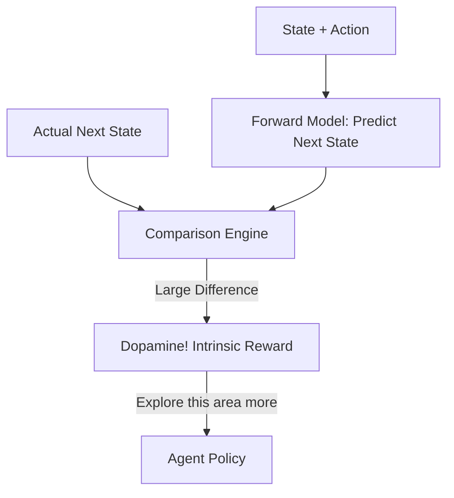

# ICM (Intrinsic Curiosity Module)

🧠 **What does this do? (The Analogy)**
Think of a **Toddler in a new room**. They don't have a "Score" or a "Task"—they just want to touch everything. If they see a button, they press it to see what happens. If the result is **Surprising** (e.g., a light turns on), they get excited and do it again. If the result is **Boring** (nothing happens), they move on to the next thing. **ICM** is an AI that gets a "Dopamine Hit" every time it fails to predict the future. This forces it to explore until it understands everything about its world.

🔍 **Step-by-Step Explanation:**
1. **The Forward Model**: The agent tries to predict what the next state ($s_{t+1}$) will look like based on its current action.
2. **Prediction Error**: If the actual next state is different from the prediction, the agent says: "I don't understand this part of the world yet!"
3. **Intrinsic Reward**: The magnitude of that error is used as a **Bonus Reward**.
4. **Self-Supervised**: ICM doesn't need a game score (External Reward). It can learn to walk, jump, and navigate just by being "curious" about the physics of its environment.

📊 **High-Level Design (HLD)**

✅ **Why use this?**
It is essential for **Sparse Reward Games**. In a game where the only reward is "Win" at the very end, a standard AI will wander randomly and never find the exit. ICM gives the AI a "Reason to Move" every single second, eventually leading it to discover the goal.

🌍 **Real-World Examples:**
1. **Scientific Discovery AI**: An AI that "explores" new chemical combinations by looking for reactions that are unexpected or surprising.
2. **Infinite Game Testing**: A bot that automatically finds every room and every secret in a video game just because it's bored by things it has already seen.
