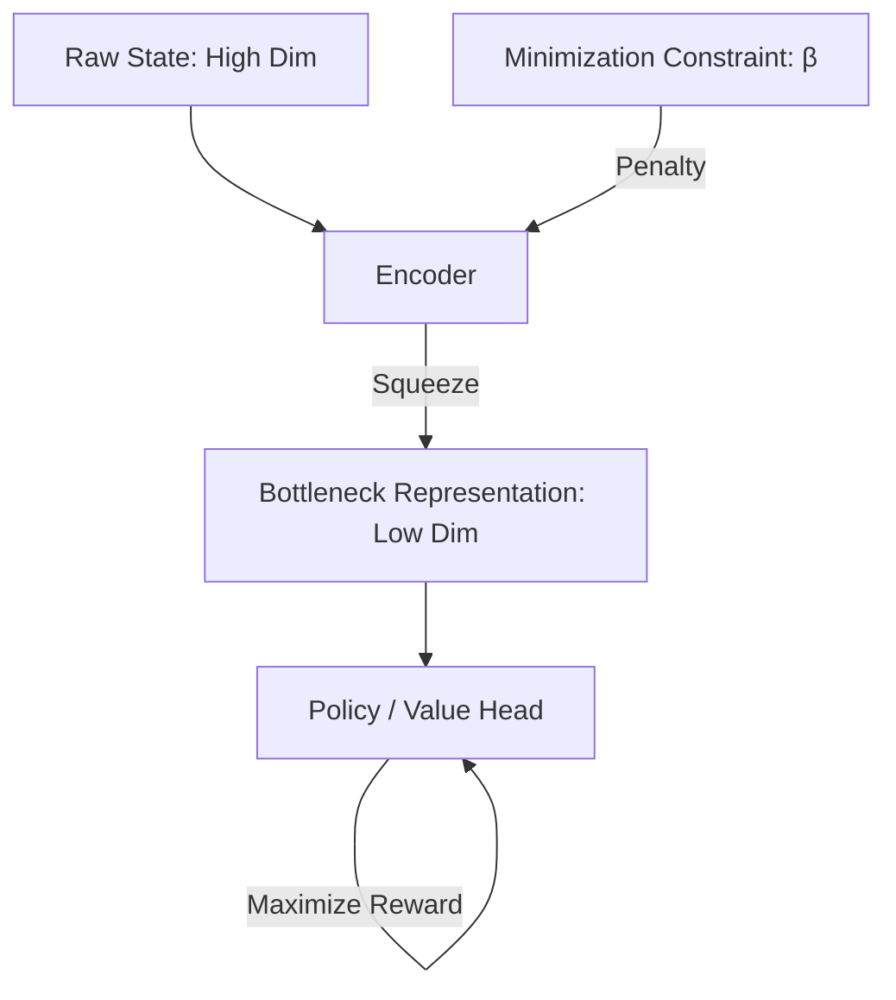

# Information Bottleneck RL

🧠 **What does this do? (The Analogy)**
Think of a **Sketch Artist**. If you tell the artist to draw a "Cat," they don't draw every single hair. That would be too much useless information. Instead, they draw the **Essence**—the ears, the whiskers, the tail. **IB-RL** is like a "Filter" in the agent's brain. It forces the agent to throw away 99% of what it sees and only keep the 1% that actually matters for winning the game. This makes the agent much more "Robust" because it doesn't get distracted by useless details (like the color of the background).

🔍 **Step-by-Step Explanation:**
1. **The Bottleneck**: The neural network is forced to pass all information through a very "narrow" layer.
2. **Mutual Information ($I$)**: We minimize the information shared between the Raw State and the Representation.
3. **The Loss Function**: $Loss = \text{Reward} - \beta \cdot \text{Information}$. 
4. **Distraction Removal**: By "forgetting" the background noise, the agent learns a representation that works even if the background changes (Generalization).
5. **Robustness**: The agent becomes immune to "Adversarial Attacks" or small changes in lighting/color because it simply isn't "looking" at those features.

📊 **High-Level Design (HLD)**

✅ **Why use this?**
It is the secret to **Generalization**. If you train a robot in a lab with a specific floor color, a standard RL agent might fail if you move it to a room with a different floor. An IB-RL agent will have learned to "Ignore the floor" entirely, so it works perfectly in both rooms.

🌍 **Real-World Examples:**
1. **Security Cameras**: An AI that only "sees" the movement of a person but completely ignores their clothing color or the shadows on the wall, making it much more reliable at detecting intruders.
2. **Financial Forecasting**: Ignoring the "daily noise" and random news headlines to focus only on the core economic signals that actually drive stock prices.
