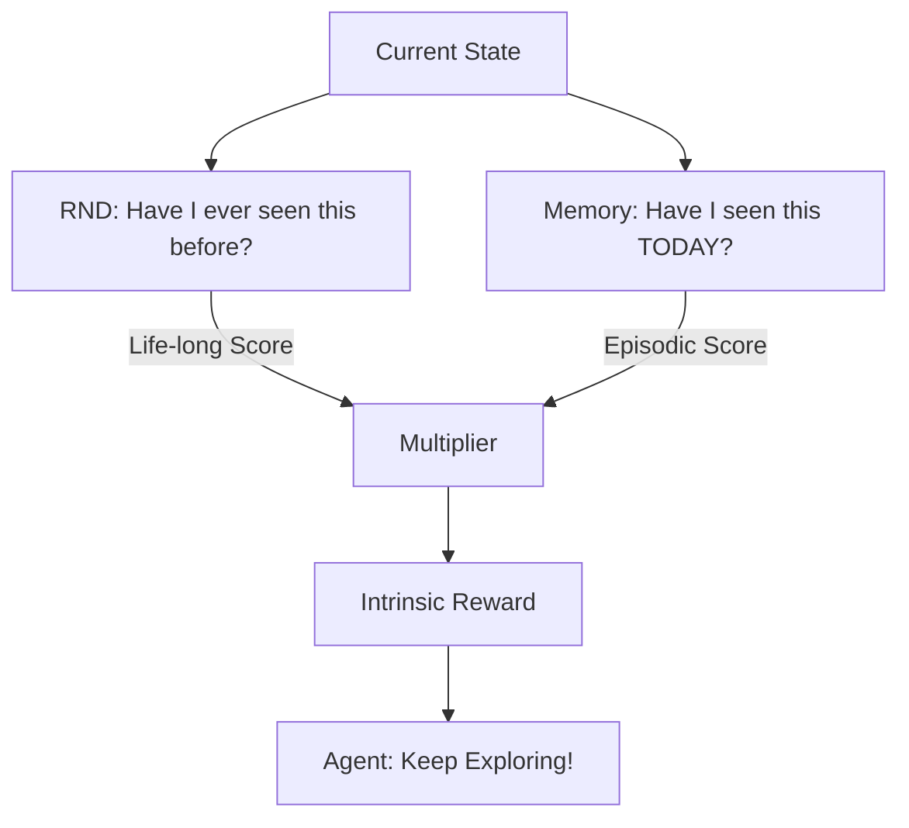

# NGU (Never Give Up)

🧠 **What does this do? (The Big Picture)**
Think of a **World Explorer**. 
1.  **Life-long Curiosity**: They want to visit a new country they've never seen before in their entire life. 
2.  **Episodic Curiosity**: Even if they are in a familiar country, they want to see a street they haven't walked down *today*.
**NGU** is an AI that combines these two scales. It gets a reward for finding things that are new for the **entire training process** AND things that are new for the **current game**. This makes it the ultimate "Boredom-Fighter"—it never gives up because it is always finding something small to be curious about.

🔍 **The Dual Curiosity Engine:**

1.  **Life-long Novelty (RND)**: 
    - Uses Random Network Distillation.
    - If the AI can't predict what a state looks like, it must be new.
    - This novelty slowly decreases over weeks of training as the AI sees everything.
2.  **Episodic Novelty (k-NN)**:
    - The AI keeps a "Short-term Memory" of the current game.
    - If a state is far away from everything in its memory, it's a "Local Discovery."
    - This resets every time a new game starts.
3.  **The Formula**: $R_{intrinsic} = R_{episodic} \times L_{life-long}$. 
    - The two curiosities multiply together to create a powerful exploration signal.

📊 **High-Level Design (HLD)**

✅ **Why use this?**
NGU is the **best algorithm for sparse-reward games**. It was the first algorithm to solve "Pitfall!" (an Atari game so hard that standard RL agents get 0 points). If you have a task where the AI has to wander for hours before finding one small success, you use NGU.

🌍 **Real-World Examples:**
1. **Undersea Exploration Robots**: Searching the vast, dark ocean floor. NGU helps the robot avoid going in circles and forces it to map out the entire area.
2. **Infinite Level Testing**: Automatically finding the exit in procedurally generated levels that are different every time you play.
