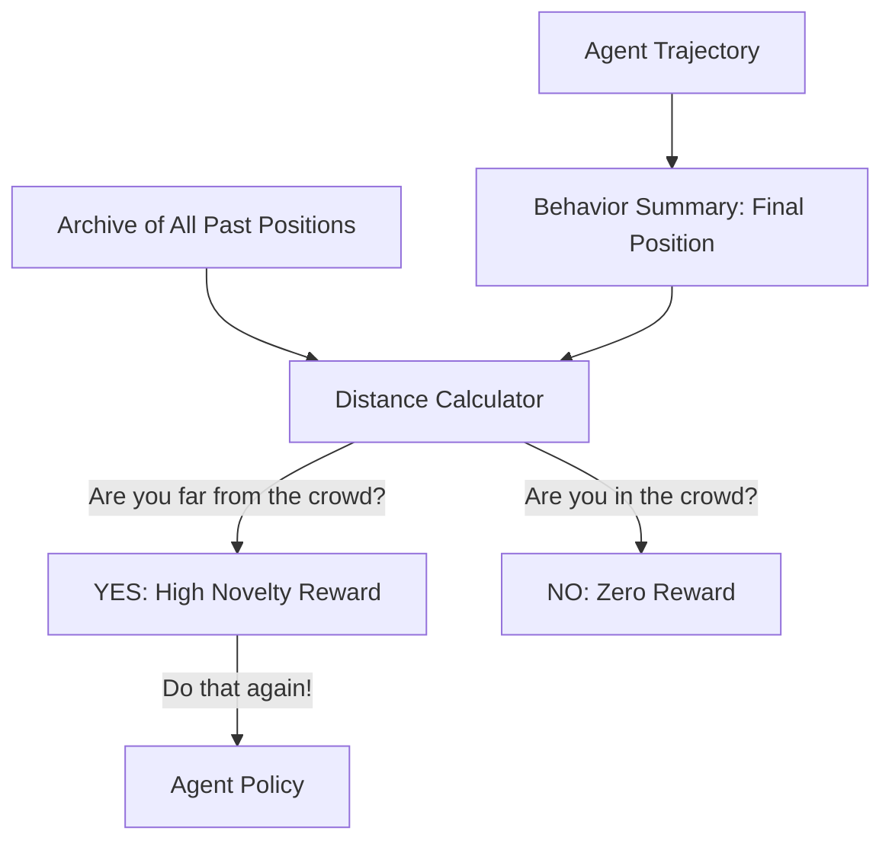

# Novelty Search (Diversity RL)

🧠 **What does this do? (The Analogy)**
Think of a **Maze that is a giant Trap**. 
- If you reward an AI for "getting closer to the exit," it will run toward the wall and get stuck in a "Local Optima." 
- **Novelty Search** says: "I don't care where the exit is. Just do something **Different**." 
- The AI is rewarded for finding a room it hasn't visited before, or for moving in a way it hasn't moved before. Eventually, because the AI is forced to try **EVERY** possible behavior, it "stumbles" upon the exit by accident. By ignoring the goal, it finds the goal faster.

🔍 **Step-by-Step Explanation:**
1. **Behavior Characterization (BC)**: A mathematical summary of what the agent did (e.g., its final X,Y position).
2. **The Archive**: A list of every BC the agent has ever produced.
3. **Novelty Metric**: The reward is the distance between the current BC and its $k$-nearest neighbors in the archive.
4. **Benefit**: It solves "Deceptive" problems where the immediate reward leads the agent into a dead end.

📊 **High-Level Design (HLD)**

✅ **Why use this?**
It is the best choice for **Open-Ended Discovery**. If you want an AI to find "New ways to walk" or "New ways to solve a puzzle," you use Novelty Search. It is the core of "Creativity" in AI.

🌍 **Real-World Examples:**
1. **Robot Gait Discovery**: Evolving a 6-legged robot to walk by first rewarding it for any "New" way of moving its legs.
2. **Architecture Design**: An AI that generates "Novel" floorplans for buildings that are different from any existing design.
