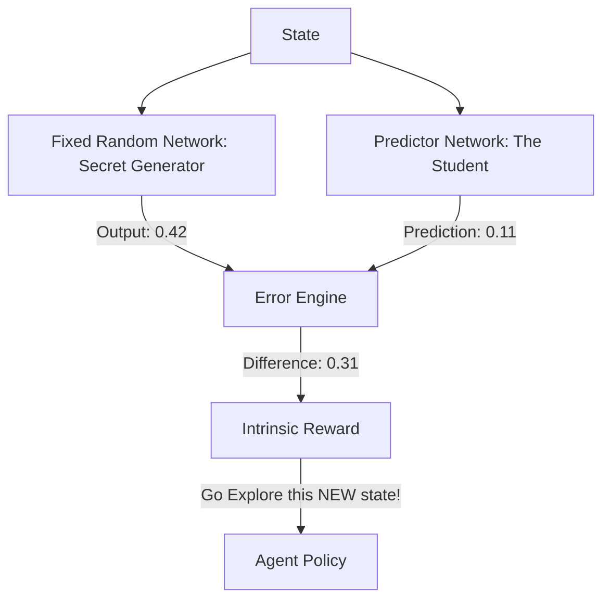

# RND (Random Network Distillation)

🧠 **What does this do? (The Analogy)**
Think of a **Secret Handshake**. 
1. There is a **Target Network** that knows a secret, random handshake for every room in a castle. 
2. There is a **Predictor Network** (The AI) that is trying to learn all those handshakes. 
3. If the AI enters a room it has seen 1,000 times, it knows the secret handshake perfectly (Prediction Error = 0). 
4. If the AI enters a **New Room**, it has no idea what the handshake is (Prediction Error = High). 
**RND** gives the AI a reward whenever it finds a handshake it doesn't know. This forces the AI to explore every single room in the castle just to "learn the handshakes."

🔍 **Step-by-Step Explanation:**
1. **The Fixed Network**: A neural network that is initialized randomly and **NEVER** changes. It maps states to random vectors.
2. **The Predictor Network**: A neural network that tries to predict the output of the Fixed Network.
3. **The Reward**: The prediction error. If the AI sees a new state, the predictor can't guess the "secret" output, so the error is high.
4. **Benefit**: Unlike ICM (Curiosity), RND doesn't get distracted by "Random Noise" (like a TV showing static). It only cares about things that are **Stable** enough to be learned but **New** enough to be unknown.

📊 **High-Level Design (HLD)**

✅ **Why use this?**
It is the current **State-of-the-Art for Pure Exploration**. It solved "Montezuma's Revenge" using only Curiosity (no game score needed!). If you have a robot in a giant warehouse and you want it to "map out everything" without you telling it what to do, you use RND.

🌍 **Real-World Examples:**
1. **Autonomous Site Inspection**: A drone that explores every inch of a construction site just because it wants to "predict" the sensor readings for every location.
2. **Unsupervised Feature Learning**: Learning what "Normal" looks like so that anything "Abnormal" (like a broken machine) produces a high RND error.
