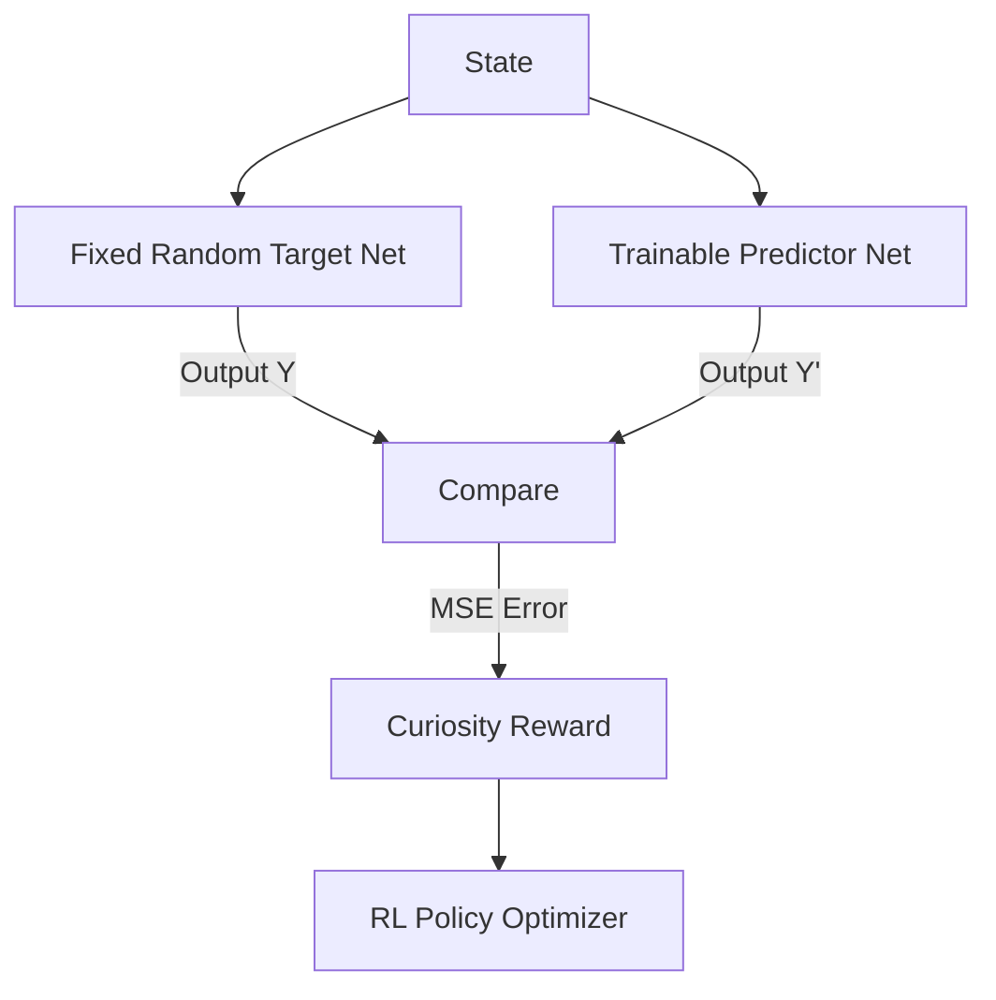

# Random Network Distillation (RND)

🧠 **What does this do? (The Analogy)**
Think of a **Secret Handshake**. You have a **Master** (Target Net) who has a secret handshake (a fixed random function). You also have a **Student** (Predictor Net). Every time you go to a new room (State), the Student tries to guess the Master's handshake. In rooms the Student has visited many times, they know the handshake perfectly (Low Error). In **new rooms**, they fail (High Error). That failure is the "Curiosity" that tells the agent: "I haven't been here before, let's explore!"

🔍 **Step-by-Step Explanation:**
1. **The Target Network**: A fixed, random neural network that never changes. It represents a "meaningful" but random fingerprint of every state.
2. **The Predictor Network**: A network that tries to predict the Target Network's output for the current state.
3. **The Intrinsic Reward**: $Reward = \|Predictor(s) - Target(s)\|^2$.
4. **Learning Familiarity**: Once the Predictor has seen a state many times, it learns to match the Target perfectly, and the reward goes to 0.
5. **Pure Curiosity**: This allows agents to explore massive worlds (like Montezuma's Revenge) without needing any points/rewards from the game!

📊 **High-Level Design (HLD)**

✅ **Why use this?**
It is the current **Gold Standard** for exploration in games with **Sparse Rewards**. It solves the "Noisy TV" problem because the Target Network is static—it won't give a reward for random noise unless that noise is actually a new state.

🌍 **Real-World Examples:**
1. **Search & Rescue**: A drone in an unknown forest is rewarded for visiting "visually new" areas, even if it hasn't found a survivor yet.
2. **Security Testing**: An AI testing a website for bugs is rewarded for finding "unusual" page layouts or server responses it hasn't seen before.
