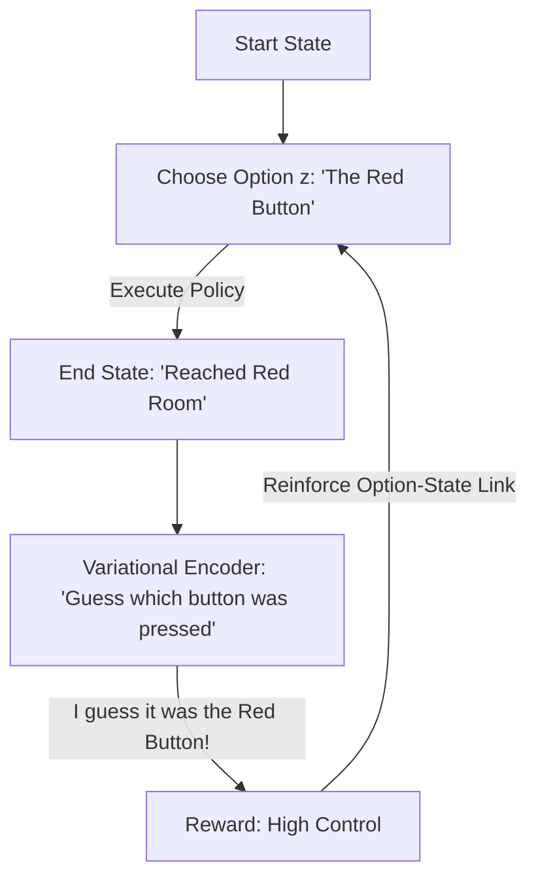

# VIC (Variational Intrinsic Control)

🧠 **What does this do? (The Analogy)**
Think of a **Remote Control with 10 buttons**. 
- If you press "Button 1," the TV should turn on. 
- If you press "Button 2," the Volume should go up. 
- **VIC** is an AI that is trying to **build its own remote control**. 
- It tries 10 different "Options" (Buttons). It is rewarded only if each button produces a **different and predictable** result in the world. 
Eventually, the AI has a "Remote Control" for its own body, allowing it to "Turn On" any specific state of the world at will.

🔍 **Step-by-Step Explanation:**
1. **Option Selection**: The agent picks a latent "Option" $z$ at the start of an episode.
2. **Execution**: The agent follows its policy to reach some final state $s_T$.
3. **Information Gain**: The agent is rewarded if the final state $s_T$ "tells us" exactly which option $z$ was chosen.
4. **Benefit**: It is a powerful way to discover **Hierarchy**. The "Options" become high-level commands (like "Go to the kitchen") that can be used by a "Master Brain" later.

📊 **High-Level Design (HLD)**

✅ **Why use this?**
It is the best choice for **Intrinsic Motivation**. It allows an AI to become a "Master of its environment" without ever receiving a single point of game score. It learns "Control" for the sake of control.

🌍 **Real-World Examples:**
1. **Robotic Hand Manipulation**: An AI that discovers how to move its fingers to achieve 100 different specific "Hand Poses" (Options) without being taught.
2. **Autonomous Drones**: Discovering "Options" like "Hover," "Flip," and "Dive" by rewarding the drone for making those states distinct and reachable.
