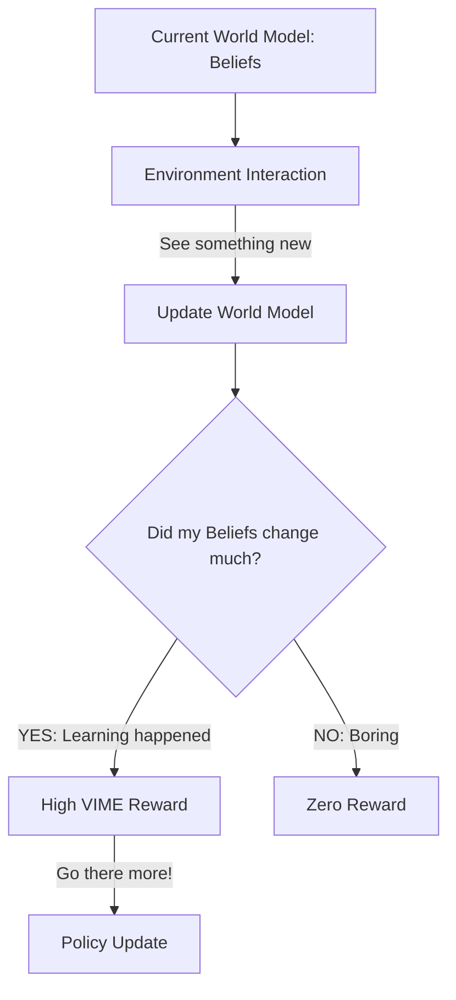

# VIME (Variational Information Maximizing Exploration)

🧠 **What does this do? (The Analogy)**
Think of a **Scientist visiting a new planet**. 
- They don't just walk around randomly. 
- They look for things that **Surprise** their existing knowledge. 
- If they see a rock that looks like a normal Earth rock, they ignore it. 
- If they see a purple floating crystal, they spend all day studying it because it **changes their understanding of physics**. 
**VIME** is an AI that is rewarded for finding data that "rewrites its own internal textbook." It goes where the "learning" is most intense.

🔍 **Step-by-Step Explanation:**
1. **Bayesian World Model**: The agent maintains a "Probability Distribution" over the possible laws of the world.
2. **Information Gain**: When the agent sees a new state, it calculates the **KL Divergence** between its "Old Beliefs" and its "New Beliefs."
3. **The Reward**: If the new state caused a massive shift in beliefs (high information gain), the agent gets a high reward.
4. **Benefit**: It is one of the most mathematically rigorous ways to handle exploration. It naturally "finishes" exploring an area once it has nothing more to learn from it.

📊 **High-Level Design (HLD)**

✅ **Why use this?**
It is the best choice for **Deep, Systematic Exploration**. If you have a problem where the reward is very rare (like a robot trying to find a specific key in a giant castle), VIME will force the robot to "learn the castle" until the key is finally found.

🌍 **Real-World Examples:**
1. **Active Learning for Drug Discovery**: An AI that chooses to run experiments on chemicals that it is the "most unsure" about, rapidly building a complete model of chemical reactions.
2. **Autonomous Driving Simulation**: A car that focuses its training on "rare events" (like a deer jumping in the road) because those events provide the most information for its safety model.
