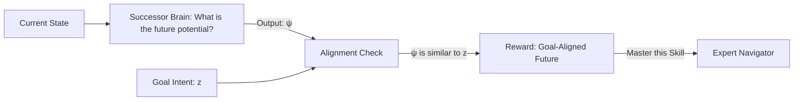

# VISR (Variational Intrinsic Successor Features)

🧠 **What does this do? (The Analogy)**
Think of a **Person planning their Career**. 
- They don't just look at "What I am doing today." 
- They look at the **Successor Features**: "If I take this job today, what other jobs will be available to me in 5 years?" 
- **VISR** is an AI that learns skills by looking at the **Future Potential** of its actions. 
- A skill is rewarded if it leads the agent to states that "match" the "Intent" of that skill. It's like having a "North Star" that guides you toward long-term goals rather than short-term rewards.

🔍 **Step-by-Step Explanation:**
1. **Successor Features ($\psi$))**: A mathematical vector that summarizes the "Average future states" reachable from here.
2. **Skill Embedding ($z$))**: A vector representing the agent's goal.
3. **Alignment**: The reward is the "Similarity" (Dot Product) between the future potential $\psi$ and the goal $z$.
4. **Benefit**: It is incredibly fast at **Transfer Learning**. Because the AI understands the "Future Potential" of the world, it can solve a new task instantly by just "picking the $z$" that matches the new task's rewards.

📊 **High-Level Design (HLD)**

✅ **Why use this?**
It is the gold standard for **Fast Adaptation**. It can play a new Atari game with 0 training just by looking at the pixels and saying: "I know which future states contain those gold coins, and I know how to get there."

🌍 **Real-World Examples:**
1. **Supply Chain Hedging**: Choosing warehouse locations today that "Successor-wise" provide the best options for many different future demand scenarios.
2. **Robot Path Planning**: Choosing a path that keeps as many "future doors open" as possible, in case a specific door is locked later.
