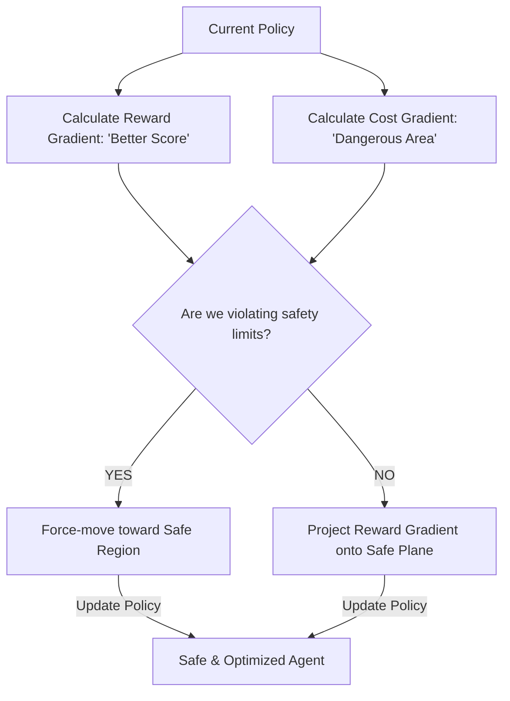

# CPO (Constrained Policy Optimization)

🧠 **What does this do? (The Analogy)**
Think of a **Tightrope Walker**. 
- They want to get to the other side (The Reward). 
- But they have a **Constraint**: They must stay on the rope (The Safety Cost). 
- If they start to lean too far to the left, they don't just "try to get to the end"—they prioritize **leaning back to the right** to stay on the rope. 
- **CPO** is a mathematical way to ensure that the AI always takes the "best possible step" that is **guaranteed** not to exceed a specific danger limit.

🔍 **Step-by-Step Explanation:**
1. **The Objective**: Maximize the reward function $J_R$.
2. **The Constraint**: Keep the safety cost function $J_C \leq \delta$.
3. **The Projection**: During every brain update, CPO looks at the "Reward Gradient" (where the AI wants to go) and "Projects" it onto the "Safe Plane" (where the AI is allowed to go).
4. **Benefit**: Unlike simple penalties, CPO **Guarantees** (with high probability) that the AI will stay within the safety limits during the entire training process.

📊 **High-Level Design (HLD)**

✅ **Why use this?**
It is the gold standard for **Safe Deep RL**. If you are training an AI in a real laboratory where "Breaking a Robot" costs $50,000, you use CPO to ensure the robot never takes a dangerous action while learning.

🌍 **Real-World Examples:**
1. **Robotic Surgery**: An AI that learns to perform a task while having a "Hard Constraint" never to touch a specific nerve or artery.
2. **Autonomous Chemical Labs**: An AI that optimizes a chemical reaction while being constrained to never exceed a specific temperature or pressure.
