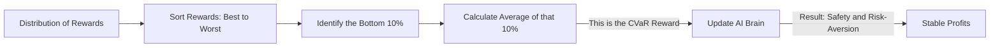

# CVaR (Conditional Value at Risk)

🧠 **What does this do? (The Analogy)**
Think of an **Insurance Agent**. 
- A normal agent (Expected Value) says: "On average, the weather is sunny, so I'll sell you a T-shirt." 
- A **CVaR Agent** says: "I don't care about the sunny days. I care about the **1% chance of a Hurricane**. If a hurricane happens, your house is gone. I will optimize your plan to survive that 1% disaster, even if it means you have a slightly less comfortable life on the sunny days." 
It is the "Pessimistic" AI that focuses entirely on the "Tail End" of risks.

🔍 **Step-by-Step Explanation:**
1. **The Tail**: Looking at the worst $10\%$ or $1\%$ of outcomes in a dataset.
2. **Value at Risk (VaR)**: The specific score at which the "disaster" starts.
3. **CVaR**: The **Average Score** of everything *beyond* that disaster point.
4. **Benefit**: It prevents the AI from taking "Gambles." A standard AI might take a 99% chance of $1,000,000 and a 1% chance of "Robot Death." A CVaR AI will say: "The 1% death is too expensive. I'll take the safe option instead."

📊 **High-Level Design (HLD)**

✅ **Why use this?**
It is the standard for **Financial Portfolio Management**. If you are managing billions of dollars, you don't care about "Mean Profit"—you care about ensuring that the "Worst Case" loss on any given day doesn't bankrupt the company.

🌍 **Real-World Examples:**
1. **Bank Stress Testing**: Simulating a market crash and optimizing the bank's assets to ensure they survive the "CVaR Event."
2. **Wildfire Prevention**: An AI that decides where to clear brush by optimizing for the "Worst 5% of Heatwaves" rather than the average summer temperature.
