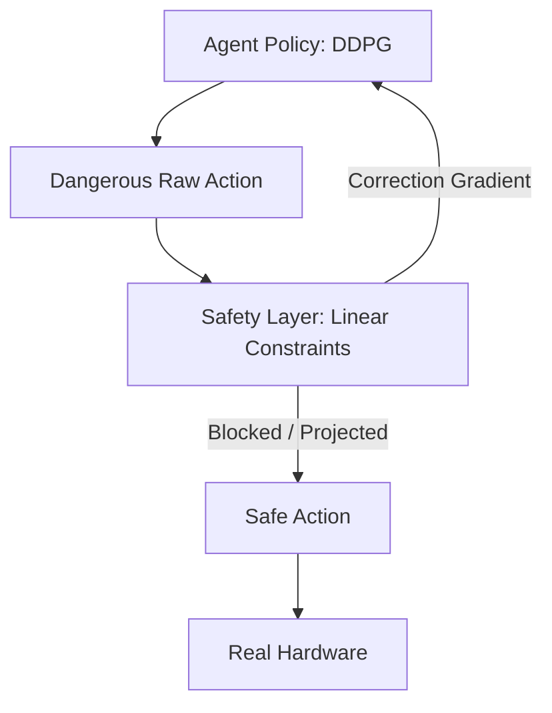

# DDPG with Safety Projection (Safe-RL)

🧠 **What does this do? (The Analogy)**
Think of a **Teenager learning to drive** with a **Driving Instructor** who has their own set of brakes. The teenager (AI) might want to floor the gas pedal to see what happens. But the Instructor (Safety Layer) physically blocks the pedal from going past the speed limit. The AI can *think* about doing something dangerous, but it is **physically impossible** for the action to reach the car's engine.

🔍 **Step-by-Step Explanation:**
1. **The Safety Layer**: A separate mathematical module that knows the "Physical Laws" of the environment (e.g., "Don't hit the wall").
2. **Action Projection**: Before the action is sent to the robot, the Safety Layer checks it. If the action is outside the "Safe Manifold," it is mathematically "Projected" (moved) to the nearest safe point.
3. **Safety Penalty**: The agent is then given a "Correction" signal so it learns that its original idea was bad.
4. **Zero Violations**: Unlike standard RL (which learns from mistakes), Safe-RL aims to **never make the mistake** in the first place.

📊 **High-Level Design (HLD)**

✅ **Why use this?**
It is mandatory for **Industrial Robotics**. If you have a $1,000,000 robot arm, you cannot let an RL agent "explore" by smashing it into the floor. You use a Safety Projection to ensure the arm always stays within a safe 3D box.

🌍 **Real-World Examples:**
1. **Collaborative Robots (Cobots)**: Ensuring a robot arm instantly stops or moves away if a human enters its "Safety Zone."
2. **Smart Power Grids**: Ensuring the AI never switches off a critical circuit that would cause a blackout, no matter what its reward function says.
