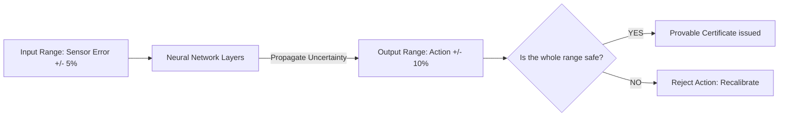

# Formal Verification RL (Provable Safety)

🧠 **What does this do? (The Analogy)**
Think of a **Bridge Inspector**. 
- A normal AI says: "I've walked across this bridge 1,000 times and it hasn't collapsed, so it's probably safe." 
- **Formal Verification** says: "I have used physics and math to prove that even if a 50-ton truck drives over this bridge during a hurricane, the bridge **cannot** collapse." 
It replaces "Hope" with **Mathematical Proof**. It uses "Interval Bound Propagation" to ensure that the neural network's output stays within a "Safe Box" no matter what happens.

🔍 **Step-by-Step Explanation:**
1. **Interval Arithmetic**: Instead of passing a single number through the network, you pass a "Range" (e.g., $[0.4, 0.6]$).
2. **Bound Propagation**: You track how that range grows as it passes through each layer of the AI.
3. **Safety Certificate**: At the end, you check if the "Maximum possible output" is still safe.
4. **Benefit**: It is the only way to get AI approved for **Aviation and Nuclear Power**.

📊 **High-Level Design (HLD)**

✅ **Why use this?**
It is the gold standard for **High-Stakes AI**. If a single failure means a loss of life or a billion-dollar disaster, you use Formal Verification to "Lock" the AI into a safe mathematical box.

🌍 **Real-World Examples:**
1. **Air Traffic Control**: Ensuring that an AI-controlled collision avoidance system never suggests a path that brings two planes closer than 1,000 feet.
2. **Medical Infusion Pumps**: Proving that an AI-controlled pump can never deliver a lethal dose of medicine, even if the sensors are slightly broken.
