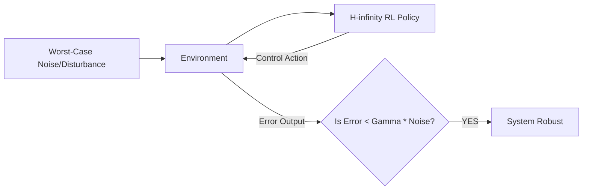

# H-infinity Robust Control RL

🧠 **What does this do? (The Analogy)**
Think of a **Ship Captain preparing for a storm**. Most RL agents prepare for the "Average" wave. **H-infinity RL** prepares for the **Single Largest Wave in History**. It assumes the environment is actively trying to "Break" the AI. It minimizes the "Worst-case impact" that any external noise (like wind or electrical glitches) can have on the system.

🔍 **Step-by-Step Explanation:**
1. **The Attenuator**: H-infinity treats the system as a "Pipe." Noise goes in, and Error comes out.
2. **Gain Limitation**: The goal is to ensure that no matter how much noise you put in, the error "output" is always multiplied by a small number ($\gamma$).
3. **Worst-Case Reward**: In RL, this means training against an "Adversarial" environment that is trying to lower the agent's score as much as possible.
4. **Benefit**: If an H-infinity agent works in a simulator, it is **Guaranteed** to work in the real world, even if the real world has unexpected wind or friction.

📊 **High-Level Design (HLD)**

✅ **Why use this?**
It is the standard for **Safety-Critical Engineering**. You use H-infinity to control the flight computers of airplanes or the cooling systems of nuclear reactors, where "Average" performance isn't enough—you need to handle the worst-case.

🌍 **Real-World Examples:**
1. **Fighter Jet Flight Control**: Ensuring the plane stays stable even if a wing is damaged or there is extreme turbulence.
2. **High-Speed Maglev Trains**: Managing the magnetic levitation perfectly even if there is an earthquake or electrical surge.
