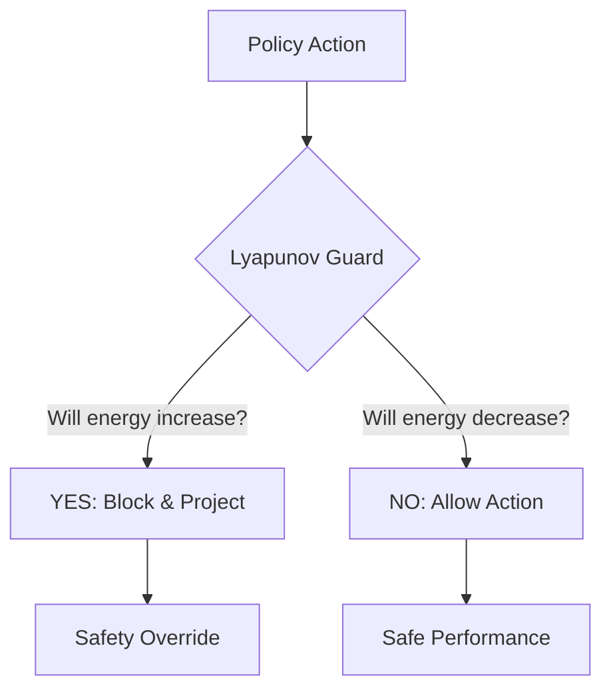

# Lyapunov Safe Control RL

🧠 **What does this do? (The Analogy)**
Think of a **Ball in a Bowl**. If you push the ball, it will always roll back down to the center. Why? Because it wants to reach the point of **Lowest Energy**. **Lyapunov RL** is a mathematical "Bowl" that we build around an AI. It ensures that no matter what the AI does, the "Energy" (Error/Risk) of the system must always decrease over time. If the AI tries to take an action that would make the system "Wobble" or "Crash," the Lyapunov function physically blocks it.

🔍 **Step-by-Step Explanation:**
1. **Lyapunov Function ($V(s)$)**: A mathematical function that is always positive and only zero at the "Perfect Goal." Think of it as a "Danger Score."
2. **Stability Criterion**: For the system to be safe, $V(s_{t+1}) - V(s_t)$ must be negative (Danger must always go down).
3. **Constrained Optimization**: The RL agent tries to maximize reward, but it is **constrained** by the rule: "The next state must have less energy/danger than the current one."
4. **Benefit**: It provides **Formal Guarantees**. You can prove with math that the robot will never fall or explode.

📊 **High-Level Design (HLD)**

✅ **Why use this?**
It is the standard for **Critical Mechanical Systems**. If you are using RL to control a multi-billion dollar satellite or a high-speed train, you cannot rely on "Neural Network Luck." You must use Lyapunov functions to guarantee stability.

🌍 **Real-World Examples:**
1. **Drones near People**: Ensuring that even if the AI "glitches," the drone's energy-management system will force it to land safely rather than fly into a crowd.
2. **Power Plant Regulation**: Keeping a nuclear or chemical reactor in the "Stable Zone" where the reaction cannot runaway.
