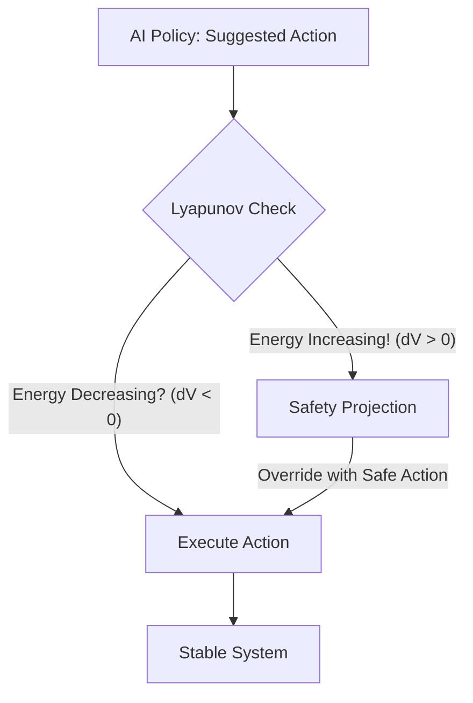

# Lyapunov Safe RL

🧠 **What does this do? (The Analogy)**
Think of a **Ball in a Bowl**. 
- No matter where the ball is, it naturally rolls toward the bottom (The Stable Point). 
- A **Lyapunov Function** is a mathematical "Bowl." 
- As long as the AI's actions keep the "Energy" of the system decreasing (rolling down), we know the system is **Safe** and will never fly off into a crash. 
If the AI tries to take an action that would push the ball *out* of the bowl, the Lyapunov function instantly "overrides" the AI and pushes the ball back down.

🔍 **Step-by-Step Explanation:**
1. **The Energy Function $V(s)$**: A function that is 0 at the goal and positive everywhere else.
2. **Stability Constraint**: We require that $V(s_{t+1}) < V(s_t)$. The system must always be losing "danger energy."
3. **Safety Shielding**: If the AI's neural network suggests an action that violates this rule, we project that action back onto the "Safe Set" of actions that satisfy the Lyapunov constraint.
4. **Benefit**: It provides **Mathematical Guarantees** of safety. You can prove a robot will never hit a wall before you even turn it on.

📊 **High-Level Design (HLD)**

✅ **Why use this?**
It is the standard for **Safety-Critical Robotics**. If you are building an autonomous car or a drone that flies near people, you use Lyapunov functions to ensure it never enters a "High-Energy" (dangerous) state.

🌍 **Real-World Examples:**
1. **Power Grid Stability**: Ensuring that voltage levels always return to the "bottom of the bowl" after a sudden spike.
2. **Human-Robot Collaboration**: Ensuring a robot arm never moves with enough "Energy" to hurt a human, regardless of what the AI wants to do.
