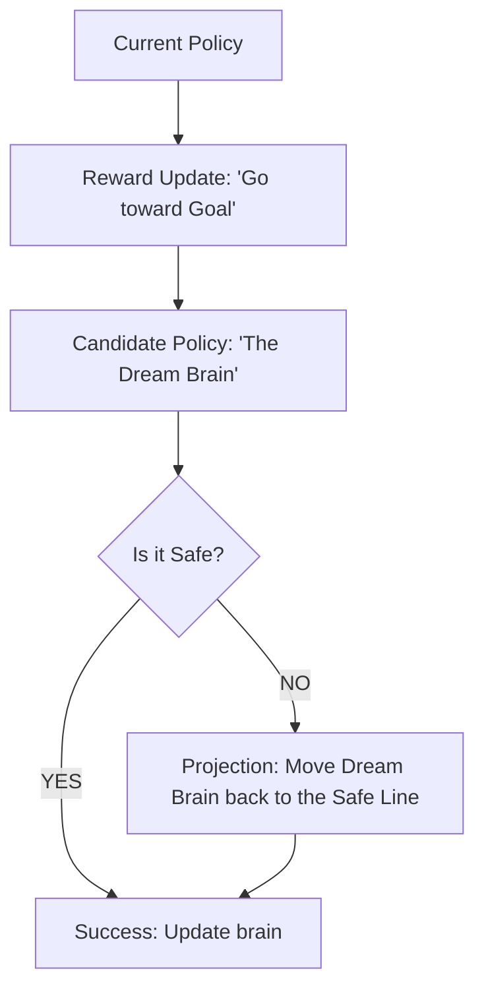

# PCPO (Projection-based Constrained Policy Optimization)

🧠 **What does this do? (The Analogy)**
Think of a **Person walking on a sidewalk next to a fence**. 
- They want to walk toward a store that is inside the fenced area. 
- **Step 1**: They take a step toward the store (Optimistic Update). 
- **Step 2**: If that step would make them "hit the fence," they instead walk **along the fence** to get as close as possible to the store without crossing the line. 
**PCPO** is a two-stage math process: First, seek reward. Second, if you broke a rule, "Project" yourself back to the nearest legal point.

🔍 **Step-by-Step Explanation:**
1. **Unconstrained Step**: Perform a standard RL update (like PPO) to find the "Best Next Brain."
2. **Constraint Check**: Measure the "Safety Cost" of that new brain.
3. **Projection**: Use the **Euclidean Projection** formula to find the brain that is "closest" to the best brain but satisfies all safety rules.
4. **Benefit**: It is more **Stable** than CPO. While CPO tries to solve both problems at once, PCPO separates them, making it less likely to "crash" during training.

📊 **High-Level Design (HLD)**

✅ **Why use this?**
It is the best choice for **Deep Safe RL** where the safety rules are complex. It allows the AI to "dream big" about rewards while always keeping its "feet on the safe ground."

🌍 **Real-World Examples:**
1. **Drones in No-Fly Zones**: A drone that optimizes its flight path to save battery (Reward) but is "projected" back if it even tries to enter a restricted airspace.
2. **Automated Trading**: Maximizing profit but "projecting" the portfolio back if it starts to hold too much of a single risky stock.
