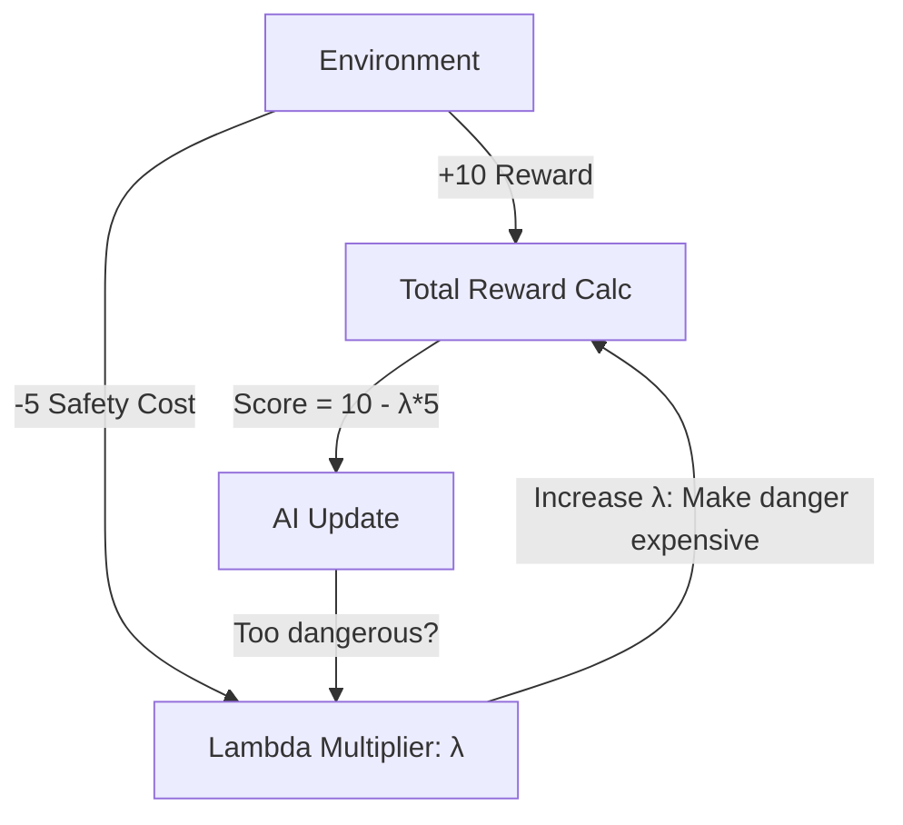

# RCPO (Reward Constrained Policy Optimization)

🧠 **What does this do? (The Analogy)**
Think of a **Speeding Ticket**. 
- You want to get to work fast (Reward). 
- The police say you must stay under 60mph (Constraint). 
- If you go 70mph, you get a $100 ticket. If you keep doing it, the ticket becomes $500 (Adaptive Lambda). 
- Eventually, the cost of the ticket is so high that you "naturally" choose to drive at 60mph, even though you still want to go fast. 
**RCPO** is an AI that learns to stay safe by "Paying the Price" for safety violations until it becomes too expensive to be dangerous.

🔍 **Step-by-Step Explanation:**
1. **The Cost Function**: A separate reward signal that only gives negative points for "Unsafe" behaviors.
2. **Lagrange Multiplier ($\lambda$)**: The "Price" of a safety violation.
3. **Adaptive Tuning**: If the agent is being too dangerous, $\lambda$ increases. If the agent is being "Too Safe" and missing rewards, $\lambda$ decreases.
4. **Benefit**: It is much easier to implement than "Projection" or "Shielding" and can solve very complex tasks.

📊 **High-Level Design (HLD)**

✅ **Why use this?**
It is the best choice for **Soft Constraints**. If it is okay to be slightly dangerous once in a while, but overall you need to be safe, RCPO is the most flexible tool.

🌍 **Real-World Examples:**
1. **Cloud Server Management**: Maximizing performance while keeping the "Cost" of electricity below a specific monthly budget.
2. **Personalized Medicine**: Optimizing a drug dose for maximum healing while "Pricing" the side effects so they never exceed a specific level.
