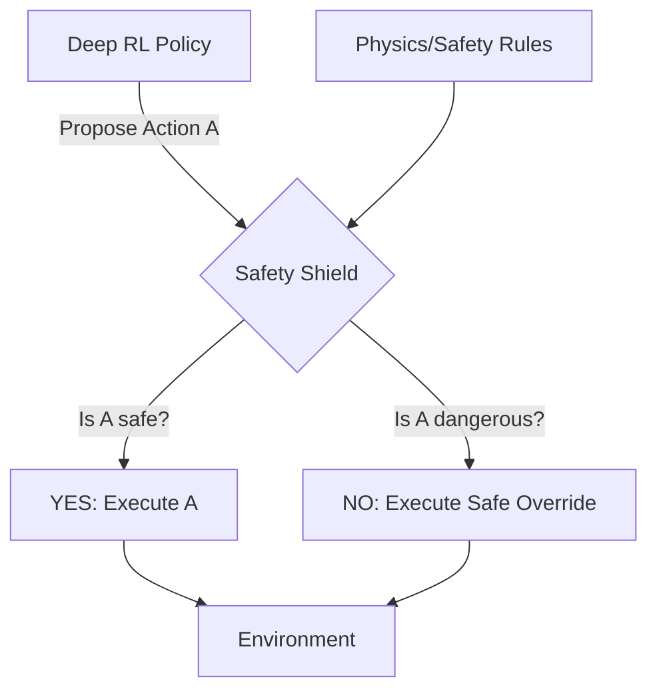

# RL with Safety Shield (Hard Constraints)

🧠 **What does this do? (The Analogy)**
Think of a **Teenager learning to drive** and a **Driving Instructor** with a second brake pedal. The teenager (RL Agent) is trying to learn how to drive fast to get a high score. But if the teenager tries to drive off a bridge, the instructor (Safety Shield) **Instantly Overrides** them. The RL Agent can learn whatever it wants, but the Shield ensures it never actually crashes the physical car.

🔍 **Step-by-Step Explanation:**
1. **The Shield**: A mathematically proven "Safe Set" of actions based on the laws of physics.
2. **Action Proposing**: The RL Agent proposes an action (e.g., "Accelerate to 100mph").
3. **Safety Verification**: The Shield checks: "In 2 seconds, will this action lead to a state where a crash is unavoidable?"
4. **The Override**: If the answer is "Yes," the Shield blocks the action and replaces it with a "Minimal Safe Action" (e.g., "Slam Brakes").

📊 **High-Level Design (HLD)**

✅ **Why use this?**
You cannot use standard RL on a **Million-dollar Industrial Robot** or a **Human-carrying Vehicle**. The risk of a "Learning Glitch" causing a fatal accident is too high. A Safety Shield provides the "Safety Guarantees" that allow RL to be used in the real world.

🌍 **Real-World Examples:**
1. **Autonomous Passenger Planes**: The AI can optimize the flight path, but the "Envelope Protection" (Shield) physically prevents it from stalling or diving too fast.
2. **Humanoid Robots in Homes**: Ensuring that even if the AI "hallucinates," it cannot move its arm with enough force to hurt a child.
