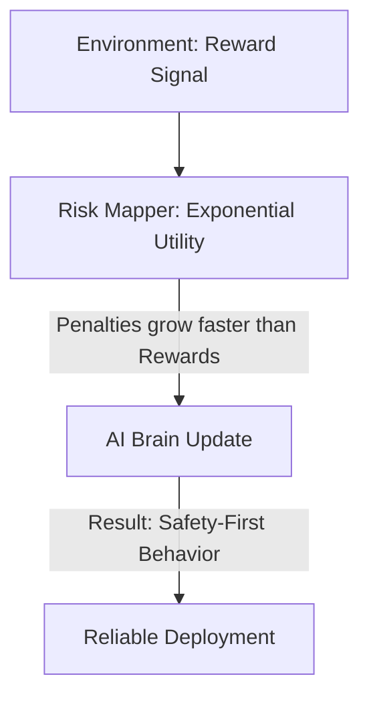

# Risk-Sensitive RL (Non-Linear Utility)

🧠 **What does this do? (The Analogy)**
Think of a **Person deciding whether to bet their life savings on a coin flip**. 
- A "Rational" math robot (Expected Value) says: "The average win is $1, so you should do it." 
- A **Risk-Sensitive Person** says: "Losing my savings would be 1,000x worse than winning an extra dollar is good." 
**Risk-Sensitive RL** is an AI that has **Feelings** about risk. It doesn't treat a $-10$ penalty the same as a $+10$ reward. It is "Afraid" of big losses, which makes it much safer in the real world.

🔍 **Step-by-Step Explanation:**
1. **The Utility Function**: Instead of maximizing $R$, the agent maximizes $U(R) = -\exp(-\beta R)$.
2. **Entropic Risk**: If $\beta$ is positive, the agent is "Risk Averse." It will choose a guaranteed $+1$ over a $50/50$ chance of $+100$ and $-100$.
3. **Worst-Case Focus**: The exponential curve makes large negative numbers "feel" infinitely large to the AI.
4. **Benefit**: It prevents the AI from "Grit-testing" (taking a tiny chance of a huge disaster to get a slightly better score).

📊 **High-Level Design (HLD)**

✅ **Why use this?**
It is the best choice for **Critical Infrastructure**. If you are managing a power plant or a water treatment facility, you don't care about "maximizing average water quality"—you care about "never letting the quality drop below a dangerous level."

🌍 **Real-World Examples:**
1. **Investment Banking**: Choosing stocks that have a "tight" distribution of returns rather than stocks that could either double or go to zero.
2. **Robotic Surgery**: An AI that moves slowly and carefully because it "fears" a single accidental cut more than it "values" a fast operation.
