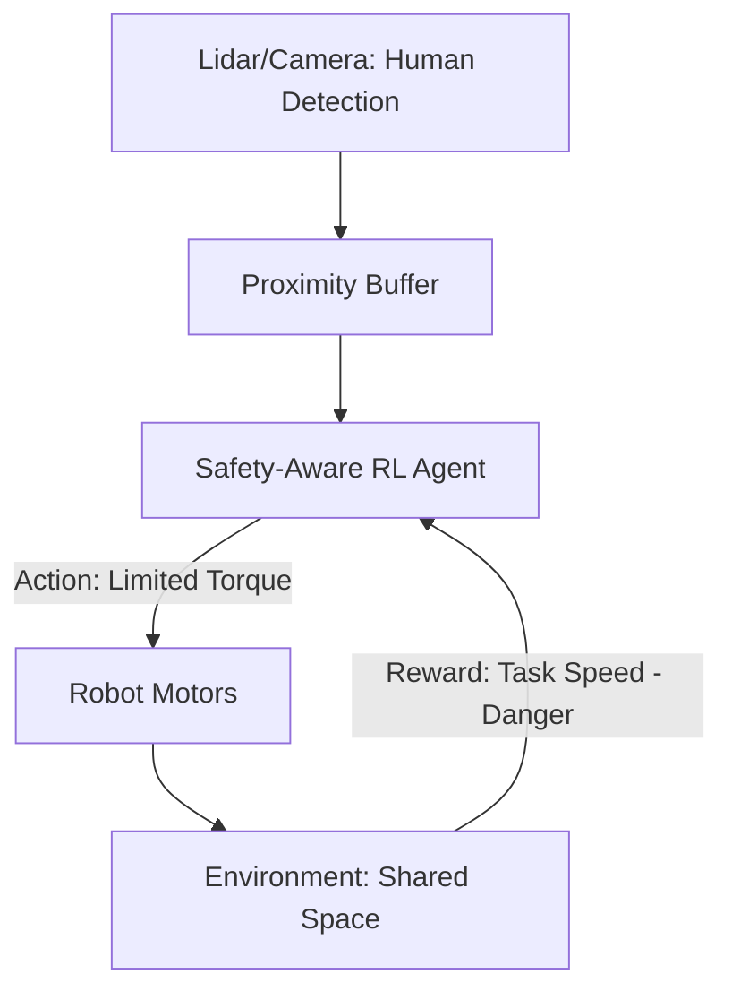

# Safe Human-Robot Interaction RL

🧠 **What does this do? (The Analogy)**
Think of a **Personal Assistant** carrying a hot tray of coffee. If they are in an empty hallway, they can run fast. If they see a person, they must slow down. If a person gets too close, they must stop completely. **Safe HRI RL** is the "Social Etiquette" brain for a robot. It allows the robot to work efficiently but ensures that a human's presence always triggers a "Safety Slowdown."

🔍 **Step-by-Step Explanation:**
1. **The State**: Proximity of humans (measured by Lidar/Cameras), relative velocity, and the robot's own weight/momentum.
2. **The Reward**: Completing the task quickly while maintaining a "Comfort Zone" for the human.
3. **The Action**: Adjusting the torque and speed of every joint in the robot's body.
4. **Collision Avoidance**: Uses "Velocity Obstacles"—mathematical shapes that define where the robot *cannot* move to avoid any future collision with the human's predicted path.

📊 **High-Level Design (HLD)**

✅ **Why use this?**
It is essential for **Cobots** (Collaborative Robots). In the old days, robots were kept in cages. Today, we want robots to work alongside humans. HRI RL provides the "Soft" and "Predictable" movements that make it safe and comfortable for a human to work 50cm away from a powerful machine.

🌍 **Real-World Examples:**
1. **Home Service Robots**: A robot that helps an elderly person stand up. It must be extremely gentle and responsive to the human's movements.
2. **Factory Assembly**: A robot that hands tools to a human worker, slowing down its arm as it gets closer to the human's hand.
