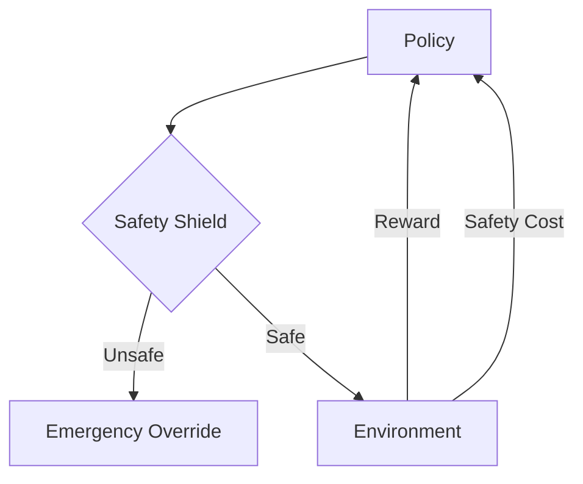

# Safe Reinforcement Learning (Safe RL)

🧠 **What does this do? (The Analogy)**
Think of a **Student Driver with a Dual-Brake Car**. The student (RL Agent) wants to reach the destination (Goal). However, there is an instructor next to them. If the student tries to drive onto the sidewalk, the instructor hits the **Safety Brake**. The agent learns not just how to reach the goal, but how to do it while **never** violating the safety rules.

🔍 **Step-by-Step Explanation:**
1. **The Cost Function ($C(s, a)$)**:
   - In standard RL, we only have Rewards ($R$).
   - In Safe RL, we have a separate **Cost** function for safety violations.
2. **Lagrangian Optimization**:
   - The agent tries to maximize $R$ while keeping $C$ below a specific threshold (e.g., $C < 0.1$).
3. **Safety Layer/Shielding**:
   - A piece of code that intercepts "bad" actions before they happen and replaces them with safe ones.

📊 **High-Level Design (HLD)**

✅ **Why use this?**
In simulation, failing is fine. In the real world, if a $50,000 robot arm hits a human or breaks itself, the experiment is over. Safe RL ensures the agent stays within "Operational Envelopes."

🌍 **Real-World Examples:**
1. **Power Grid Balancing**: Ensuring the voltage never exceeds safe limits while trying to maximize electricity distribution efficiency.
2. **Surgical Robots**: Ensuring the robot never applies more than a specific amount of pressure to delicate tissue while performing a task.
