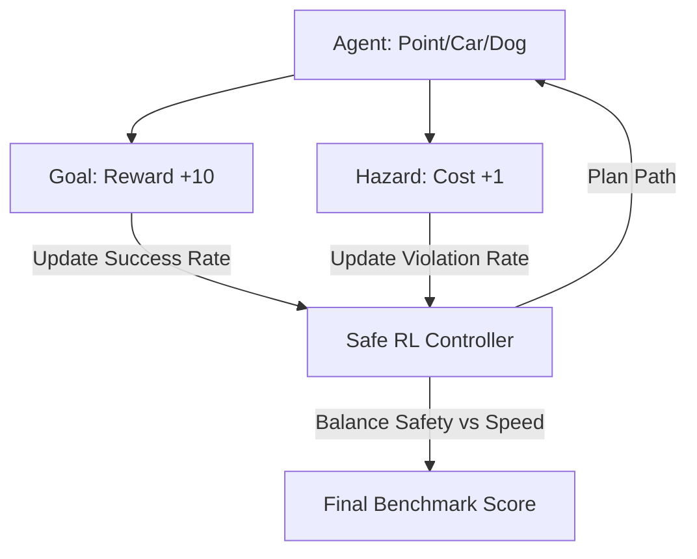

# Safety Gym (Constrained Benchmarks)

🧠 **What does this do? (The Analogy)**
Think of a **Parkour Course full of landmines**. 
- A normal parkour course (Gym) only rewards you for being fast. 
- **Safety Gym** rewards you for being fast **AND** requires that you never touch a single landmine. 
- It is the standard playground where researchers test their "Safe RL" algorithms. 
- It provides a "Two-Part Score": how many points you got (Reward) and how many times you exploded (Cost). 
A perfect agent gets 100 points and 0 explosions.

🔍 **Step-by-Step Explanation:**
1. **The Cost Signal**: Environments explicitly return a `cost` variable alongside the `reward`.
2. **Hazards**: Objects like "Mines," "Walls," and "Vases" that must not be touched.
3. **Constrained MDP**: The math assumes that $J_R$ (Reward) is what you maximize, but $J_C$ (Cost) must stay below a threshold (e.g., 25).
4. **Benefit**: It allows for a **Fair Comparison**. If Agent A is 5% faster but Agent B is 100% safer, Safety Gym allows us to see that Agent B is actually "Better" for the real world.

📊 **High-Level Design (HLD)**

✅ **Why use this?**
It is the gold standard for **Validating Safety Claims**. If you say your new AI is "Safe," you have to prove it on the Safety Gym benchmarks before the research community will believe you.

🌍 **Real-World Examples:**
1. **Self-Driving Car Software Testing**: Testing if a car can navigate a city without ever touching a pedestrian or a traffic cone.
2. **Industrial Assembly Line**: Testing if a robot can assemble a car as fast as possible without ever "colliding" with a human worker.
