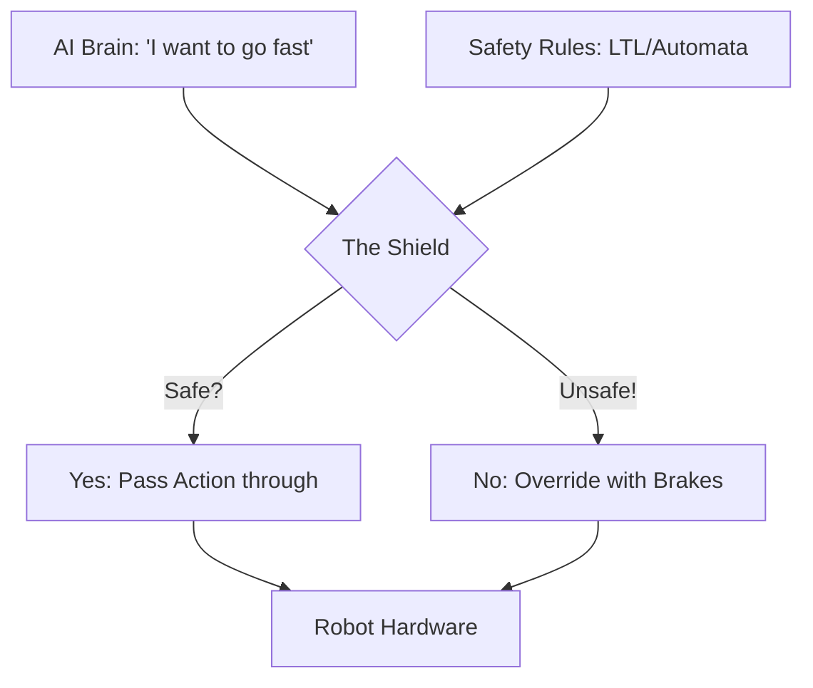

# Shielding RL (Correct-by-Construction)

🧠 **What does this do? (The Analogy)**
Think of a **Student Driver and an Instructor**. 
- The student (The AI) is trying to learn how to drive. They make mistakes and try to turn onto the sidewalk. 
- The instructor (The Shield) has their own set of pedals. 
- The instructor doesn't care *how* the student drives, but as soon as the student tries to do something illegal or dangerous, the instructor **slams the brakes**. 
The AI is allowed to explore and learn as long as it stays within the "Legal Bounds" defined by the Shield.

🔍 **Step-by-Step Explanation:**
1. **The Specification**: A set of "Safety Rules" (e.g., "Don't cross the red line").
2. **The Monitor**: A separate piece of code that runs alongside the AI.
3. **Intervention**: Before the action reaches the robot, the Monitor checks: "Will this action result in a violation of my rules within the next 2 steps?"
4. **Correction**: If yes, the Monitor overrides the AI with a "Safe Default" action.

📊 **High-Level Design (HLD)**

✅ **Why use this?**
It is the best way to handle **Compliance and Law**. If your AI is managing a hospital or a power plant, you can't rely on "Reward Penalties" (which only learn from failure). You need a Shield that **prevents failure from ever happening.**

🌍 **Real-World Examples:**
1. **Industrial Robotics**: A shield that prevents a robot arm from moving into the space occupied by a human, regardless of what the neural network wants.
2. **Finance Trading Bots**: A "Risk Shield" that blocks any trade that would exceed the legal capital requirements of the bank.
