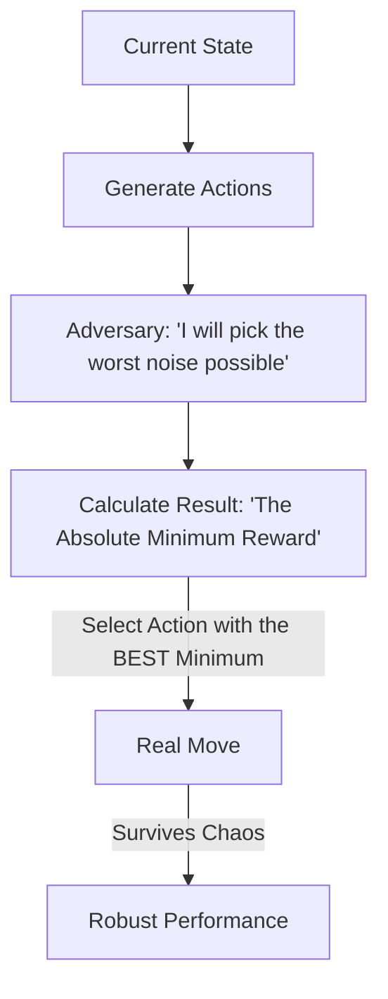

# Worst-Case Robust RL (Minimax)

🧠 **What does this do? (The Analogy)**
Think of a **Person preparing for a hike**. 
- A normal hiker (Optimistic) says: "The forecast says sun, so I'll only bring a T-shirt." 
- A **Robust Hiker** says: "The forecast might be wrong. Even if it **rains AND snows**, I need to survive. I'll bring a raincoat and a jacket." 
**Worst-Case Robust RL** is an AI that assumes the universe is "out to get it." It optimizes for the **worst possible situation** so that no matter what happens, it stays safe and successful.

🔍 **Step-by-Step Explanation:**
1. **The Adversary**: The AI imagines there is a "Ghost" in the environment that is constantly trying to mess with its sensors or push it over.
2. **Minimax Optimization**: $\max_{Policy} \min_{Adversary} Reward$.
3. **Worst-Case Evaluation**: For every action, the AI calculates the score as if the worst possible luck happened.
4. **Benefit**: It is the most **Battle-Hardened** AI. It can be trained in a simulator and moved to the real world without "breaking" because it already prepared for things to be "worse" than the simulator.

📊 **High-Level Design (HLD)**

✅ **Why use this?**
It is the best choice for **Sim-to-Real Transfer**. If your simulator is 90% accurate but 10% wrong, Robust RL will assume the 10% error is the "worst possible error" and learn to ignore it.

🌍 **Real-World Examples:**
1. **Space Exploration**: A Mars rover that is designed to work even if the gravity is slightly different than expected or the ground is slipperier than the lab tests.
2. **Autonomous Drones**: Flying in high winds by assuming the "Worst Gust" will happen at the worst possible time.
